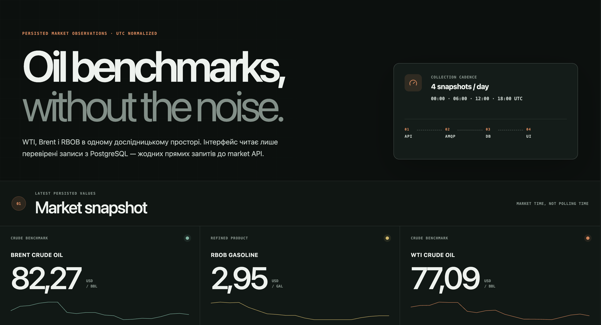
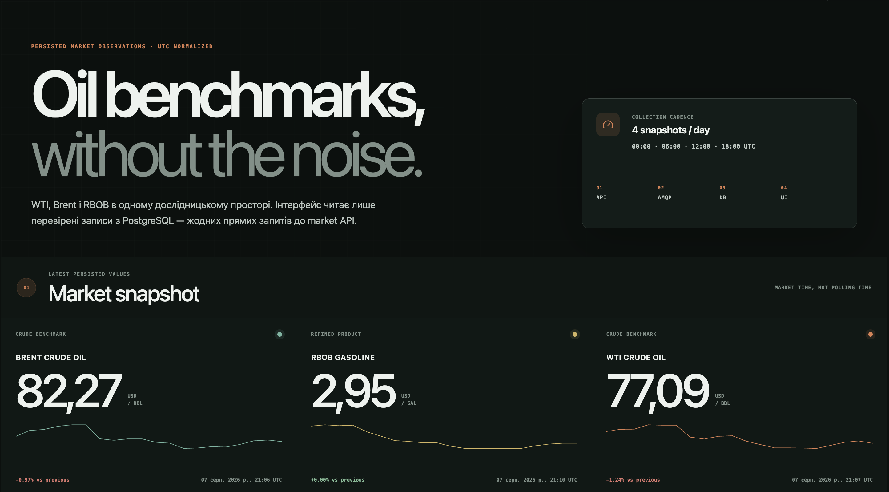
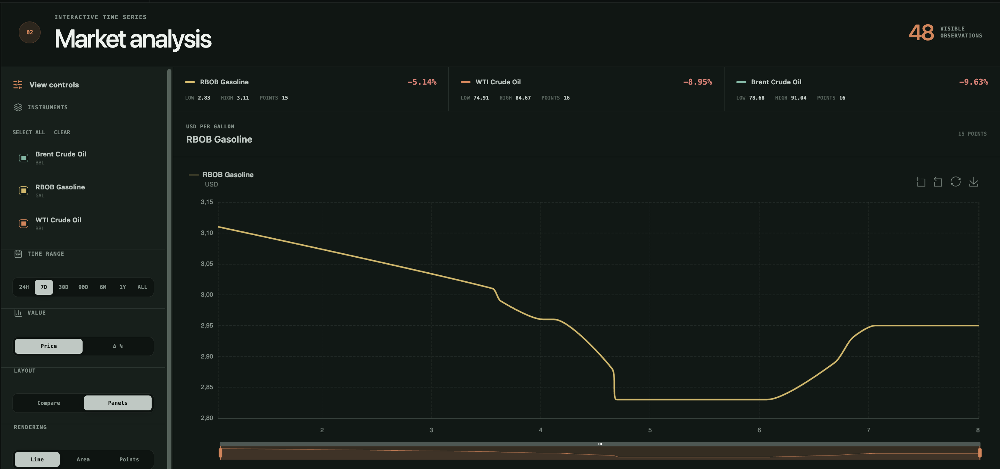
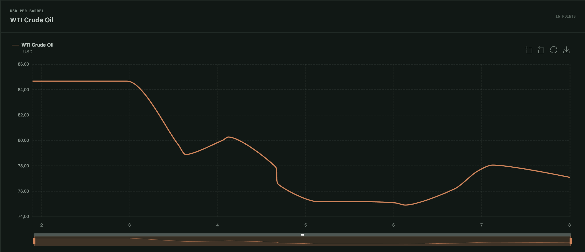
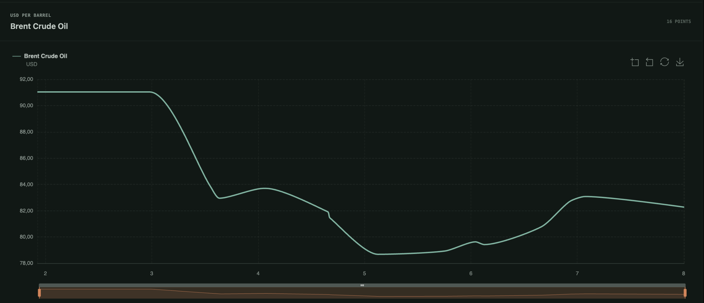
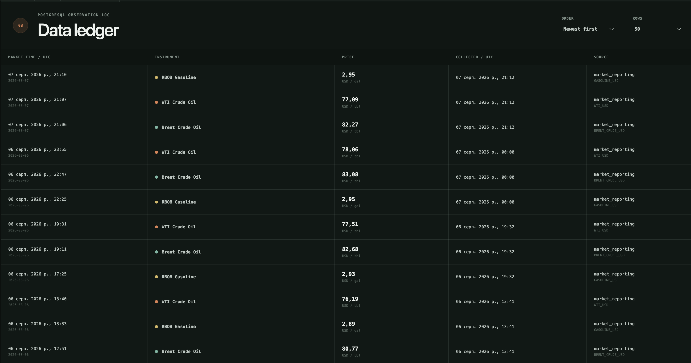

# Oil Price Tracker

Oil Price Tracker is a small research-oriented, multi-service application for collecting,
storing, and visualizing oil and gasoline market prices. It tracks WTI crude oil, Brent
crude oil, and RBOB gasoline through OilPriceAPI.

The system deliberately separates data collection from presentation. The browser never
calls the external market API or the Fetcher directly. It reads only observations that
have already been persisted in PostgreSQL.

## Features

- Scheduled collection at `00:00`, `06:00`, `12:00`, and `18:00` UTC.
- One OilPriceAPI batch request for WTI, Brent, and RBOB per collection slot.
- Asynchronous, durable delivery through a PostgreSQL event queue.
- Idempotent PostgreSQL persistence with source and collection timestamps.
- Interactive React charts with instrument, date-range, scale, style, comparison,
  smoothing, and moving-average controls.
- PostgreSQL-backed UI preferences with a sliding 30-day TTL.
- Multi-stage Docker images and one Docker Compose project per VM.
- Four-machine Vagrant deployment using QEMU and static bridged LAN addresses.
- Passwordless project-specific SSH access and journald-based container logging.

## Screenshots

### Application overview



### Latest market snapshot



### Interactive market analysis



### Individual benchmark charts

| WTI Crude Oil | Brent Crude Oil |
|---|---|
|  |  |

### Persisted observation ledger



## Technology stack

| Area | Technology |
|---|---|
| Fetcher | Go 1.25 |
| History API | Python 3.12, FastAPI, SQLAlchemy, psycopg, uv |
| UI backend | Python 3.12, FastAPI, httpx, SQLAlchemy, psycopg, uv |
| UI frontend | React 19, TypeScript, Vite, Apache ECharts |
| Persistence, event delivery, and UI sessions | PostgreSQL 18 |
| Packaging | Docker Engine and Docker Compose |
| Virtualization | Vagrant, QEMU, Ubuntu 24.04 ARM64 |

## Architecture

The runtime is divided into three application services backed by PostgreSQL.

| Component | Responsibility | Owns |
|---|---|---|
| Go Fetcher | Runs the UTC schedule, calls OilPriceAPI, validates the response, and stores price events in PostgreSQL | External API integration and collection schedule |
| History Service | Validates direct observation batches, persists observations, and exposes read endpoints | Market history and PostgreSQL access |
| UI Service | Serves the React application, proxies read-only requests to History, and manages user preferences | Browser-facing HTTP API and sessions |
| PostgreSQL | Stores price events, normalized observations, source metadata, and UI sessions | All durable application state |

### Data flow

1. The Go Fetcher selects the current scheduled UTC slot.
2. It sends one HTTPS request to `https://api.oilpriceapi.com/v1/prices/latest` for all
   configured instruments.
3. The Fetcher stores a versioned event durably in PostgreSQL table `price_events`.
4. History validates direct batches and commits normalized records to `price_observations`.
5. The UI Service requests saved observations from History over HTTP.
6. The browser receives only persisted data through the UI Service.
7. UI preferences are stored in PostgreSQL with a sliding expiration timestamp.

Database uniqueness on `(instrument_code, scheduled_for)` makes observation ingestion
idempotent. PostgreSQL is the only stateful infrastructure dependency.

## Tracked instruments

| Internal code | OilPriceAPI code | Instrument | Unit |
|---|---|---|---|
| `WTI_USD_BBL` | `WTI_USD` | WTI Crude Oil | USD/barrel |
| `BRENT_USD_BBL` | `BRENT_CRUDE_USD` | Brent Crude Oil | USD/barrel |
| `RBOB_GASOLINE_USD_GAL` | `GASOLINE_USD` | RBOB Gasoline | USD/gallon |

RBOB is a wholesale exchange-traded gasoline product, not the retail price at a specific
fuel station. Source timestamps come from OilPriceAPI; collection timestamps do not imply
that the upstream market value changed four times per day.

The Fetcher performs up to four HTTP attempts with exponential backoff. A deterministic
`mock` provider is available for offline development, but mock observations are not a
scientific data source.

## Repository layout

```text
.
├── assets/
│   └── screenshots/                Application screenshots
├── database/
│   └── migrations/                 PostgreSQL migrations
├── infrastructure/
│   ├── docker/                     Dockerfiles and per-VM Compose files
│   └── vagrant/
│       ├── commands/               Host-side deployment commands
│       ├── config/                 Vagrant configuration template
│       └── provisioning/           Idempotent guest provisioning scripts
├── services/
│   ├── fetcher/                    Go scheduler, provider, and PostgreSQL event publisher
│   ├── history/                    Python History API and PostgreSQL persistence
│   └── ui/
│       ├── backend/                Python UI gateway and PostgreSQL sessions
│       └── frontend/               React and TypeScript application
├── .env.example                    Local application configuration template
├── pyproject.toml                  Python dependencies and tooling
├── uv.lock                         Locked Python dependencies
└── Vagrantfile                     Four-VM QEMU definition
```

## Vagrant deployment

The deployment targets Apple Silicon and uses only the `vagrant-qemu` provider. Vagrant
creates the VMs and runs shell provisioners. Docker is installed by
`infrastructure/vagrant/provisioning/docker-install.sh`; the native Vagrant Docker
provisioner is not used.

### VM layout

| VM | Default example IP | Containers | Exposed ports |
|---|---:|---|---|
| `database` | `192.168.88.220` | PostgreSQL | `5432/tcp` |
| `history` | `192.168.88.221` | History Service | `8001/http` |
| `fetcher` | `192.168.88.222` | Go Fetcher | `8002/http` |
| `ui` | `192.168.88.223` | UI Service | `8080/http` |

These addresses are examples. Configure four unused addresses from the host's real LAN,
reserve them outside the router's dynamic DHCP pool, and keep them unique. The QEMU
`vmnet-bridged` network makes the VMs reachable from other devices on the same LAN.

### Host prerequisites

- macOS on Apple Silicon.
- QEMU.
- Vagrant.
- The `vagrant-qemu` plugin.
- Four unused and reserved LAN addresses.
- An OilPriceAPI key.

Install the provider plugin once:

```bash
vagrant plugin install vagrant-qemu
```

### Configure the deployment

Create the application environment file:

```bash
cp .env.example .env
```

Set a real key in `.env`:

```dotenv
OILPRICEAPI_KEY=your-real-key
DATA_PROVIDER=oilpriceapi
```

Create the Vagrant environment file:

```bash
cp infrastructure/vagrant/config/vagrant.env.example \
  infrastructure/vagrant/config/vagrant.env
```

At minimum, review and set:

```dotenv
QEMU_VMNET_INTERFACE=en0
LAN_CIDR=192.168.88.0/24
LAN_NETMASK=255.255.255.0

DB_LAN_IP=192.168.88.220
HISTORY_LAN_IP=192.168.88.221
FETCHER_LAN_IP=192.168.88.222
UI_LAN_IP=192.168.88.223

DB_PASSWORD=use-a-real-password
```

Do not commit `.env` or `infrastructure/vagrant/config/vagrant.env`; both are ignored.

### Start everything

```bash
./infrastructure/vagrant/commands/up.sh
```

The command performs preflight validation, creates the project SSH key and aliases,
downloads the ARM64 QEMU box when required, starts the VMs in dependency order, installs
Docker, runs the four Compose projects, applies PostgreSQL migrations, and verifies
cross-VM communication.

After a deployment using the example addresses, open:

- Application: `http://192.168.88.223:8080`
- History OpenAPI: `http://192.168.88.221:8001/docs`
- Fetcher health: `http://192.168.88.222:8002/health`

### Day-to-day commands

```bash
# Validate configuration and address availability
./infrastructure/vagrant/commands/preflight.sh

# Display configured VM addresses and endpoints
./infrastructure/vagrant/commands/show-ips.sh

# Verify Docker, containers, HTTP services, PostgreSQL, SSH, and logging
./infrastructure/vagrant/commands/verify.sh

# Re-sync and reprovision one VM
./infrastructure/vagrant/commands/provision.sh fetcher

# Run Docker Compose commands on one VM
./infrastructure/vagrant/commands/compose.sh history ps
./infrastructure/vagrant/commands/compose.sh ui logs --tail=100 ui

# Read journald container logs
./infrastructure/vagrant/commands/logs.sh fetcher --follow

# Stop all VMs
./infrastructure/vagrant/commands/halt.sh
```

The host setup creates a dedicated Ed25519 key at `~/.ssh/oil_tracker_ed25519`, creates
the `oiladmin` user on every VM, installs the public key, and manages project aliases in
`~/.ssh/config`:

```bash
ssh app
ssh database
ssh history
ssh worker
```

`worker` is an alias for the Fetcher VM.

## Docker deployment details

Each VM runs one independent Docker Compose project:

| Compose file | Project | Services |
|---|---|---|
| `compose.database.yaml` | `petroscope-database` | `postgres` |
| `compose.history.yaml` | `petroscope-history` | `history` |
| `compose.fetcher.yaml` | `petroscope-fetcher` | `fetcher` |
| `compose.ui.yaml` | `petroscope-ui` | `ui` |

Communication between VMs uses the configured bridged LAN addresses. PostgreSQL owns the
only named data volume. All containers use `restart: unless-stopped` and the journald logging
driver.

Journald is limited by provisioning to 200 MB and seven days per VM. Grafana and Loki are
not part of this project.

### Published application images

GitHub Actions builds and publishes every application image to GitHub Container Registry:

| Application | Image |
|---|---|
| Fetcher | `ghcr.io/<owner>/push-and-pray/fetcher` |
| History | `ghcr.io/<owner>/push-and-pray/history` |
| UI | `ghcr.io/<owner>/push-and-pray/ui` |

Replace `<owner>` with the lowercase GitHub account or organization that owns the
repository. Every published image receives the full commit SHA as an immutable tag.
Additional moving tags identify the delivery channel:

- pushes to `develop`: `develop` and `integration`;
- pushes to `main`: `main` and `latest`;
- release tags matching `v*`: the Git tag and, for semantic versions, normalized version
  and `major.minor` tags (for example `v1.4.2`, `1.4.2`, and `1.4`).

Images are pushed only after a successful Buildx build. The registry login uses the
workflow-scoped `GITHUB_TOKEN`, which GitHub Actions masks in logs; workflows do not print
or pass the token as a Docker build argument.

## Local development

Local development requires Python 3.12+, uv, Go 1.25+, Node.js, and PostgreSQL.

Install Python dependencies and build the frontend:

```bash
uv sync
npm ci --prefix services/ui/frontend
npm run build --prefix services/ui/frontend
```

Apply the database migrations:

```bash
for migration in database/migrations/*.sql; do
  PGPASSWORD=change-me psql \
    -h 127.0.0.1 \
    -U oil_tracker \
    -d oil_tracker \
    -v ON_ERROR_STOP=1 \
    -f "${migration}"
done
```

Start the History Service:

```bash
uv run --frozen --env-file .env \
  uvicorn --app-dir services/history/src \
  history_service.main:app --host 127.0.0.1 --port 8001
```

Start the Fetcher in a second terminal:

```bash
set -a
source .env
set +a
cd services/fetcher
go run ./cmd/fetcher
```

Start the UI Service in a third terminal:

```bash
uv run --frozen --env-file .env \
  uvicorn --app-dir services/ui/backend/src \
  ui_service.main:app --host 127.0.0.1 --port 8080
```

Open `http://localhost:8080`.

`uv` manages the local `.venv` automatically. Do not create or activate it manually;
run Python tools through `uv run`.

## HTTP API

### Fetcher (`:8002`)

| Method | Path | Purpose |
|---|---|---|
| `GET` | `/health` | Provider, schedule, next run, and last collection status |
| `POST` | `/v1/fetch` | Run the latest scheduled slot manually |

### History Service (`:8001`)

| Method | Path | Purpose |
|---|---|---|
| `GET` | `/health` | PostgreSQL and event worker status |
| `POST` | `/v1/observations/batch` | Direct idempotent batch ingestion |
| `GET` | `/v1/observations` | Filtered and paginated history |
| `GET` | `/v1/observations/latest` | Latest observation per instrument |
| `GET` | `/v1/instruments` | Available instruments |
| `GET` | `/docs` | OpenAPI documentation |

### UI Service (`:8080`)

| Method | Path | Purpose |
|---|---|---|
| `GET` | `/` | React application |
| `GET` | `/health` | History and PostgreSQL status |
| `GET` | `/api/observations` | Read-only proxy to persisted history |
| `GET` | `/api/latest` | Read-only proxy to latest persisted values |
| `GET` | `/api/instruments` | Read-only proxy to instruments |
| `GET` | `/api/session/preferences` | Read or create UI preferences |
| `PUT` | `/api/session/preferences` | Update UI preferences |

## Data model

The `price_observations` table stores exact decimal prices, normalized instrument data,
source metadata, and four different time concepts:

| Column | Meaning |
|---|---|
| `source_period` | Source calendar date |
| `source_observed_at` | Exact upstream market timestamp |
| `scheduled_for` | Fetcher's scheduled UTC slot |
| `fetched_at` | Actual external HTTP request time |
| `created_at` | PostgreSQL insertion time |

The original upstream price object is retained in `raw_data` as JSONB. SQL migrations are
ordered in `database/migrations/` and are safe to apply repeatedly.

The `price_events` table is the durable queue between Fetcher and History. Each row holds
one versioned batch payload plus `status` (`pending`, `processing`, `processed`, or
`failed`), an `attempts` counter, `available_at` (when it may next be claimed),
`processing_started_at`, and `last_error`. `event_key` is unique, so a retried Fetcher
publish never inserts a duplicate event.

## Configuration

| Variable | Default | Purpose |
|---|---|---|
| `OILPRICEAPI_KEY` | none | OilPriceAPI token |
| `DATA_PROVIDER` | `oilpriceapi` | `oilpriceapi` or `mock` |
| `FETCH_CRON_HOURS` | `0,6,12,18` | Four distinct schedule hours |
| `FETCH_TIMEZONE` | `UTC` | Schedule timezone |
| `FETCH_ON_STARTUP` | `true` | Collect the latest slot after startup |
| `REQUEST_TIMEOUT_SECONDS` | `15` | External HTTP timeout |
| `DATABASE_URL` | see `.env.example` | Fetcher, History, and UI PostgreSQL connection |
| `HISTORY_SERVICE_URL` | `http://127.0.0.1:8001` | UI-to-History base URL |
| `SESSION_TTL_SECONDS` | `2592000` | PostgreSQL-backed sliding session TTL, 30 days |
| `SESSION_COOKIE_SECURE` | `false` | Secure-cookie flag for HTTPS deployments |
| `LISTEN_ADDRESS` | `:8002` | Fetcher diagnostic API address |
| `LOG_LEVEL` | `INFO` | Python service log level |

## Tests and checks

```bash
uv run pytest
uv run ruff check .
(cd services/fetcher && go test ./...)
(cd services/ui/frontend && npm run typecheck && npm run build)
```

## Security notes

- Never commit `.env` or `infrastructure/vagrant/config/vagrant.env`.
- Replace all example passwords before deployment.
- Reserve the VM addresses and restrict sensitive LAN ports at the router or firewall when
  the network is not trusted.
- `SESSION_COOKIE_SECURE=false` is suitable only for local HTTP. Enable it behind HTTPS.
- PostgreSQL is exposed to the configured LAN for this lab deployment; production
  deployments should restrict its network exposure.
