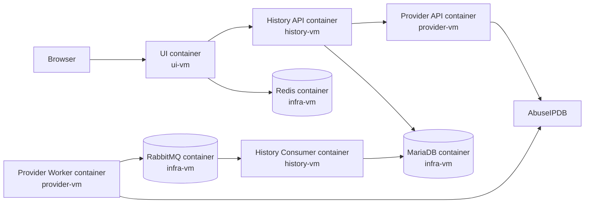

# Aegis

Aegis is an educational multi-service IP reputation application. It validates
public IPv4 and IPv6 addresses, checks them through AbuseIPDB, persists
successful manual lookups, periodically retrieves blacklist snapshots, and
presents persisted data and analytics through a server-rendered web interface.

## Architecture

Aegis has three independently configured logical application services:

- **UI Service** renders pages, calls History for application data, and stores
  anonymous UI preferences in Redis.
- **History Service** provides the application API, orchestrates manual
  lookups, exclusively owns MariaDB data, and consumes blacklist messages from
  RabbitMQ.
- **Provider Service** adapts AbuseIPDB. Its standalone worker polls for
  blacklist snapshots and publishes complete messages directly to RabbitMQ.

The target Vagrant deployment uses four VMs and eight separate containers:

| VM | Containers |
| --- | --- |
| `ui-vm` | UI Service |
| `history-vm` | History API; History Consumer |
| `provider-vm` | Provider API; Provider Worker |
| `infra-vm` | MariaDB; RabbitMQ with management plugin; Redis |

Every application runtime executes inside a container. API and background
runtimes remain separate containers belonging to their logical services.
Application VMs are not merged.



Provider never accesses MariaDB. UI talks only to History for application data.
History Consumer invokes History application-layer ingestion logic and ACKs a
message only after successful persistence. RabbitMQ remains the asynchronous
snapshot transport; snapshots are not pushed to History through HTTP.

### Data flows

Manual lookup remains synchronous:

```text
Browser -> UI -> History API -> Provider API -> AbuseIPDB
```

Blacklist synchronization is asynchronous:

```text
Provider Worker -> AbuseIPDB -> RabbitMQ
RabbitMQ -> History Consumer -> History ingestion logic -> MariaDB
```

UI preference persistence is isolated:

```text
Browser session cookie -> UI Service -> Redis
```

See [Architecture](docs/architecture.md),
[API contracts](docs/api-contracts.md),
[target Vagrant deployment](docs/development-vagrant.md), and
[architecture decisions](docs/adr/) for details.

## Repository layout

```text
services/
├── ui-service/
├── history-service/
└── provider-service/

provision/             Vagrant provisioning scripts
scripts/               Repository verification helpers
docs/                  Architecture, deployment, contracts, and ADRs
```

Each service owns its dependencies, configuration, boundary models, and tests.
There is no shared application package.

## Runtime processes

The five application runtimes are:

- UI Service;
- History API;
- History Consumer;
- Provider API;
- Provider Worker.

The target deployment runs each in its designated container. History API and
History Consumer may use the same History image but never the same container.
Provider API and Provider Worker follow the same rule. Exactly one Provider
Worker runs on `provider-vm`.

## Configuration ownership

- UI owns History and Redis connection settings.
- History owns MariaDB and RabbitMQ consumer credentials; History API also
  owns the Provider API URL.
- Provider owns AbuseIPDB and RabbitMQ publisher credentials.

Real secrets stay outside version control and are injected at runtime. Provider
does not receive MariaDB or Redis credentials; UI does not receive Provider,
MariaDB, or RabbitMQ credentials.

Service-local examples remain under:

- [UI environment example](services/ui-service/.env.example)
- [History environment example](services/history-service/.env.example)
- [Provider environment example](services/provider-service/.env.example)

## Local development

Install the supported `uv` version and synchronize the locked workspace:

```bash
uv sync --locked --all-packages --all-extras
```

This repository environment is for development and tests. The target Vagrant
deployment packages the application runtimes into service-owned images rather
than running this virtualenv on VM hosts.

Database schema changes belong to History:

```bash
.venv/bin/alembic -c services/history-service/alembic.ini upgrade head
```

More service-specific behavior is documented in the
[UI](services/ui-service/README.md),
[History](services/history-service/README.md), and
[Provider](services/provider-service/README.md) READMEs.

## Target Vagrant deployment

The target environment contains:

```text
ui-vm        192.168.100.10
history-vm   192.168.100.11
provider-vm  192.168.100.12
infra-vm     192.168.100.14
```

MariaDB, RabbitMQ, and Redis share `infra-vm` but remain independent
containers. MariaDB accepts application access only from History, Redis only
from UI, and RabbitMQ from Provider and History. RabbitMQ management is
bound to the private Vagrant interface.

The Vagrant provisioning builds the application images and starts one Compose
stack per VM. No application Python process runs on a VM host.

See [Vagrant container deployment](docs/development-vagrant.md) for
container placement, networking, secrets, startup order, migration, and
verification requirements.

On Windows, run Vagrant directly from PowerShell; WSL is not required. The
deployment guide includes native secret initialization and the complete
VirtualBox lifecycle workflow.

## Testing

Run the standard repository checks:

```bash
make check
scripts/typecheck.sh
```

Or run individual checks:

```bash
.venv/bin/uv lock --check
.venv/bin/ruff check .
.venv/bin/ruff format --check .
.venv/bin/pytest
scripts/typecheck.sh
```

Opt-in MariaDB and RabbitMQ integration tests require dedicated infrastructure.
The default test suite does not require live MariaDB, RabbitMQ, Redis, or
AbuseIPDB.

## Current limitations

- AbuseIPDB is the only reputation provider.
- There is no authentication or user management.
- Provider retrieves at most 1000 entries per blacklist snapshot.
- Redis stores only anonymous UI preferences.
- Before RabbitMQ confirms direct publication, a Provider Worker or VM failure
  can lose the in-memory fetched snapshot.
- Kubernetes, cloud deployment, TLS termination, and a public reverse proxy are
  outside this Vagrant design.

The browser reads only persisted blacklist data through UI and History.
Displaying or polling blacklist pages does not call Provider or consume
AbuseIPDB quota.
