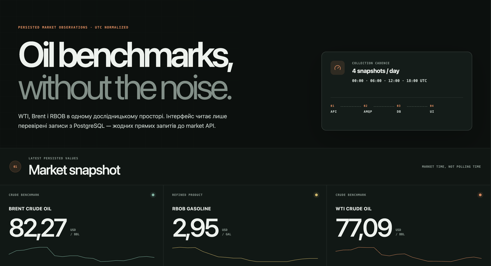
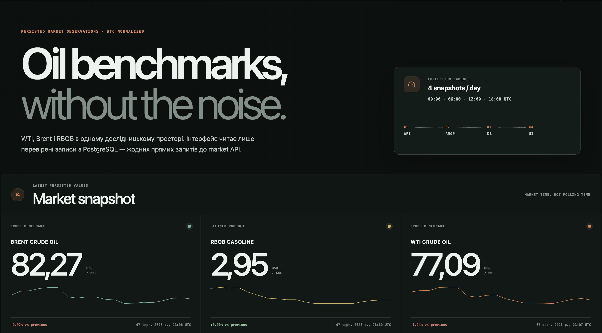
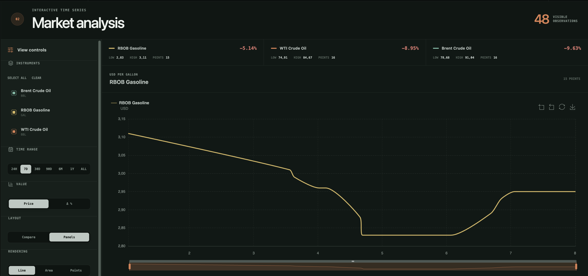
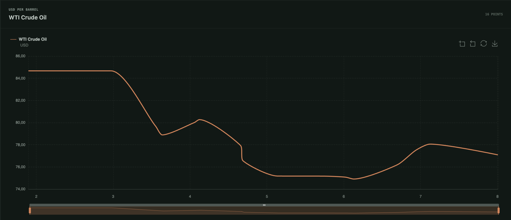
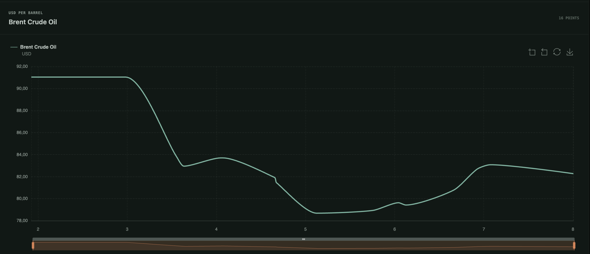
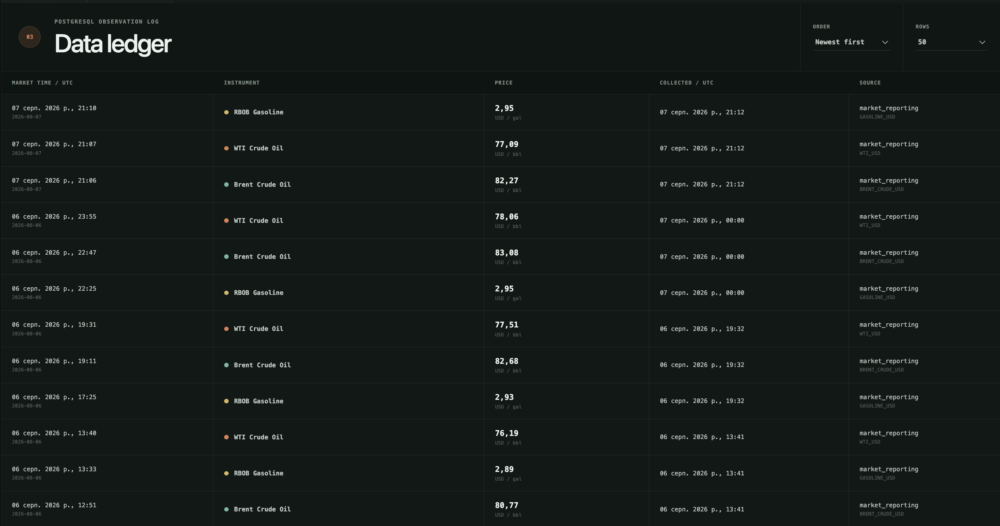

# Oil Price Tracker

Oil Price Tracker is a small research-oriented, multi-service application for collecting,
storing, and visualizing oil and gasoline market prices. It tracks WTI crude oil, Brent
crude oil, and RBOB gasoline through OilPriceAPI.

The system deliberately separates data collection from presentation. The browser never
calls the external market API or the Fetcher directly. It reads only observations that
have already been persisted in PostgreSQL.

## Features

- Scheduled collection at `00:00`, `06:00`, `12:00`, and `18:00` UTC.
- One OilPriceAPI batch request for WTI, Brent, and RBOB per collection slot.
- Asynchronous, durable delivery through RabbitMQ, backed by a PostgreSQL
  publishing outbox so a crash between commit and publish can't lose an event.
- Idempotent PostgreSQL persistence with source and collection timestamps.
- Interactive React charts with instrument, date-range, scale, style, comparison,
  smoothing, and moving-average controls.
- Redis-backed UI preferences with a sliding 30-day TTL.
- Multi-stage Docker images, deployed on AWS as Helm releases on a three-node
  k3s cluster and on the other clouds as one Docker Compose project per VM.
- Four-machine Vagrant deployment using QEMU and static bridged LAN addresses.
- Passwordless project-specific SSH access and journald-based container logging.

## Deployment paths

There are two, and which one applies depends on the cloud:

| Cloud | Runtime | Start here |
| ----- | ------- | ---------- |
| AWS | k3s with embedded etcd, three dual-role nodes, Traefik ingress | [docs/k3s-deployment.md](docs/k3s-deployment.md) |
| GCP, Azure | one Docker Compose project per VM | [docs/supported-compose-deployment.md](docs/supported-compose-deployment.md) |

Anything below that describes per-VM Compose projects, per-VM service roles or a
bastion host is the second path. The AWS path has none of those: every node runs
the control plane and workloads, and operator access is a direct SSH or
Kubernetes API connection from an allow-listed address.

## Screenshots

### Application overview



### Latest market snapshot



### Interactive market analysis



### Individual benchmark charts

| WTI Crude Oil                                                        | Brent Crude Oil                                                          |
| -------------------------------------------------------------------- | ------------------------------------------------------------------------ |
|  |  |

### Persisted observation ledger



## Technology stack

| Area           | Technology                                    |
| -------------- | --------------------------------------------- |
| Fetcher        | Go 1.24                                       |
| History API    | Python 3.12, FastAPI, SQLAlchemy, psycopg, uv |
| UI backend     | Python 3.12, FastAPI, httpx, psycopg, uv      |
| UI frontend    | React 19, TypeScript, Vite, Apache ECharts    |
| Messaging      | RabbitMQ, with a PostgreSQL publishing outbox |
| Persistence    | PostgreSQL 18                                 |
| UI sessions    | Redis, with native TTL expiry                 |
| Packaging      | Docker Engine; Helm on AWS, Docker Compose elsewhere |
| Orchestration  | k3s on AWS                                    |
| Virtualization | Vagrant, QEMU, Ubuntu 24.04 ARM64             |

## Architecture

The runtime is divided into three application services and three infrastructure
components.

| Component       | Responsibility                                                                                    | Owns                                             |
| --------------- | ------------------------------------------------------------------------------------------------- | ------------------------------------------------ |
| Go Fetcher      | Runs the UTC schedule, calls OilPriceAPI, validates the response, and publishes price events      | External API integration and collection schedule |
| History Service | Consumes RabbitMQ events, validates batches, persists observations, and exposes read endpoints    | Market history and PostgreSQL access             |
| UI Service      | Serves the React application, proxies read-only requests to History, and manages user preferences | Browser-facing HTTP API and sessions             |
| RabbitMQ        | Transports observation events from Fetcher to History over TLS, with a retry/dead-letter topology | Queue delivery, retries, and dead-lettering      |
| PostgreSQL      | Stores observations and the durable publishing outbox                                             | Durable market data and outbox state             |
| Redis           | Stores UI session preferences with native TTL expiry                                              | Session state                                    |

### Data flow

1. The Go Fetcher selects the current scheduled UTC slot.
2. It sends one HTTPS request to `https://api.oilpriceapi.com/v1/prices/latest` for all
   configured instruments.
3. The Fetcher inserts an event key, payload, and `status='pending'` into the
   `published_queue_events` outbox table in one PostgreSQL transaction —
   preventing duplicate publication of the same event before anything is sent.
4. A retry-ticker dispatcher publishes pending outbox rows to RabbitMQ over
   TLS (`amqps`) with publisher confirms and mandatory routing, marking a row
   `sent` only after the broker confirms acceptance and no unroutable return
   is observed. A failed or ambiguous publish leaves the row `pending` with an
   exponentially backed-off `next_attempt_at` for the next retry pass.
5. History consumes with manual acknowledgment: it validates and commits
   observations to PostgreSQL first, and only acknowledges the message after
   that commit succeeds.
6. A processing failure republishes the message, with an incremented retry
   count, to a delayed-retry queue; failures that exceed the retry limit go to
   a durable, inspectable dead-letter queue instead of being silently dropped.
7. The UI Service requests saved observations from History over HTTP.
8. The browser receives only persisted data through the UI Service.
9. UI preferences are stored in Redis under a hashed session key, with the
   configured TTL refreshed on every read and write.

The PostgreSQL outbox and RabbitMQ's publisher confirms together give
at-least-once delivery from Fetcher to History; database uniqueness on
`(instrument_code, scheduled_for)` keeps redelivery idempotent on the
consuming side.

## Tracked instruments

| Internal code           | OilPriceAPI code  | Instrument      | Unit       |
| ----------------------- | ----------------- | --------------- | ---------- |
| `WTI_USD_BBL`           | `WTI_USD`         | WTI Crude Oil   | USD/barrel |
| `BRENT_USD_BBL`         | `BRENT_CRUDE_USD` | Brent Crude Oil | USD/barrel |
| `RBOB_GASOLINE_USD_GAL` | `GASOLINE_USD`    | RBOB Gasoline   | USD/gallon |

RBOB is a wholesale exchange-traded gasoline product, not the retail price at a specific
fuel station. Source timestamps come from OilPriceAPI; collection timestamps do not imply
that the upstream market value changed four times per day.

The Fetcher performs up to four HTTP attempts with exponential backoff. A deterministic
`mock` provider is available for offline development, but mock observations are not a
scientific data source.

## Repository layout

```text
.
├── assets/
│   └── screenshots/                Application screenshots
├── database/
│   └── migrations/                 PostgreSQL migrations
├── infrastructure/
│   ├── ansible/                    oilscope.platform collection: inventory, playbooks, roles
│   ├── docker/                     Dockerfiles and per-VM Compose files
│   ├── helm/                       Charts, pinned third-party versions, chart values
│   ├── terraform/                  Single root over the aws/gcp/azure/cloudflare modules
│   └── vagrant/
│       ├── commands/               Host-side deployment commands
│       ├── config/                 Vagrant configuration template
│       └── provisioning/           Idempotent guest provisioning scripts
├── services/
│   ├── fetcher/                    Go scheduler, provider, and RabbitMQ outbox publisher
│   ├── history/                    Python History API and RabbitMQ consumer
│   └── ui/
│       ├── backend/                Python UI gateway and Redis sessions
│       └── frontend/               React and TypeScript application
├── .env.example                    Local application configuration template
├── pyproject.toml                  Python dependencies and tooling
├── uv.lock                         Locked Python dependencies
└── Vagrantfile                     Four-VM QEMU definition
```

## Vagrant deployment

Legacy Vagrant provisioning files remain in the repository, but they are not part of the
currently supported deployment path, and their Compose files have not been updated to
start RabbitMQ or Redis alongside the application services. The current application
architecture is validated through Docker and cloud-oriented deployments using PostgreSQL,
RabbitMQ, and Redis.

## Docker deployment details

This section describes the Compose path, which is what GCP and Azure still run.
For AWS, see [docs/k3s-deployment.md](docs/k3s-deployment.md).

The Compose deployment pulls prebuilt GHCR images through
the `oilscope.platform.compose_project` Ansible role. See
[the supported Compose deployment guide](docs/supported-compose-deployment.md) for the
required parent-process environment, the one-command startup, independent VM roles,
shutdown, and smoke test.

The older role-specific files below remain for the Vagrant development topology:

| Compose file            | Project               | Services   |
| ----------------------- | --------------------- | ---------- |
| `compose.database.yaml` | `petroscope-database` | `postgres` |
| `compose.history.yaml`  | `petroscope-history`  | `history`  |
| `compose.fetcher.yaml`  | `petroscope-fetcher`  | `fetcher`  |
| `compose.ui.yaml`       | `petroscope-ui`       | `ui`       |

Containers on the same VM use their Compose network and service names. Communication
between VMs uses the configured bridged LAN addresses. PostgreSQL uses a named Docker volume. All containers use `restart: unless-stopped` and the journald
logging driver.

Journald is limited by provisioning to 200 MB and seven days per VM. Grafana and Loki are
not part of this project.

### Published application images

GitHub Actions builds and publishes every application image to GitHub Container Registry:

| Application | Image                                   |
| ----------- | --------------------------------------- |
| Fetcher     | `ghcr.io/<owner>/push-and-pray/fetcher` |
| History     | `ghcr.io/<owner>/push-and-pray/history` |
| UI          | `ghcr.io/<owner>/push-and-pray/ui`      |

The AWS path does not use these. `.github/workflows/publish-pavlo.yaml` builds
the same four images on a `pavlo-v*` tag and pushes them to ECR, authenticating
by OIDC with no stored AWS key, then prints each digest to the job summary. The
Helm charts are deployed by digest, never by tag — so a moving tag like
`latest` has nothing to point at in that path.

Replace `<owner>` with the lowercase GitHub account or organization that owns the
repository. Every published image receives the full commit SHA as an immutable tag.
Additional moving tags identify the delivery channel:

- pushes to `develop`: `develop` and `integration`;
- pushes to `main`: `main` and `latest`;
- release tags matching `v*`: the Git tag and, for semantic versions, normalized version
  and `major.minor` tags (for example `v1.4.2`, `1.4.2`, and `1.4`).

Images are pushed only after a successful Buildx build. The registry login uses the
workflow-scoped `GITHUB_TOKEN`, which GitHub Actions masks in logs; workflows do not print
or pass the token as a Docker build argument.

## Local development

Local development requires Python 3.12+, uv, Go 1.24+, Node.js, PostgreSQL 18,
RabbitMQ, and Redis.

Install Python dependencies and build the frontend:

```bash
uv sync
npm ci --prefix services/ui/frontend
npm run build --prefix services/ui/frontend
```

Apply the database migrations:

```bash
for migration in database/migrations/common/*.sql database/migrations/application/*.sql; do
  PGPASSWORD=change-me psql \
    -h 127.0.0.1 \
    -U oil_tracker \
    -d oil_tracker \
    -v ON_ERROR_STOP=1 \
    -f "${migration}"
done
```

Start the History Service:

```bash
uv run --frozen --env-file .env \
  uvicorn --app-dir services/history/src \
  history_service.main:app --host 127.0.0.1 --port 8001
```

Start the Fetcher in a second terminal:

```bash
set -a
source .env
set +a
cd services/fetcher
go run ./cmd/fetcher
```

Start the UI Service in a third terminal:

```bash
uv run --frozen --env-file .env \
  uvicorn --app-dir services/ui/backend/src \
  ui_service.main:app --host 127.0.0.1 --port 8080
```

Open `http://localhost:8080`.

`uv` manages the local `.venv` automatically. Do not create or activate it manually;
run Python tools through `uv run`.

## HTTP API

### Fetcher (`:8002`)

| Method | Path        | Purpose                                                  |
| ------ | ----------- | -------------------------------------------------------- |
| `GET`  | `/health`   | Provider, schedule, next run, last collection, RabbitMQ outbox delivery status, and pending-outbox backlog |
| `POST` | `/v1/fetch` | Run the latest scheduled slot manually                   |

### History Service (`:8001`)

| Method | Path                      | Purpose                           |
| ------ | ------------------------- | --------------------------------- |
| `GET`  | `/health`                 | PostgreSQL and RabbitMQ consumer status |
| `POST` | `/v1/observations/batch`  | Direct idempotent batch ingestion |
| `GET`  | `/v1/observations`        | Filtered and paginated history    |
| `GET`  | `/v1/observations/latest` | Latest observation per instrument |
| `GET`  | `/v1/instruments`         | Available instruments             |
| `GET`  | `/docs`                   | OpenAPI documentation             |

### UI Service (`:8080`)

| Method | Path                       | Purpose                                           |
| ------ | -------------------------- | ------------------------------------------------- |
| `GET`  | `/`                        | React application                                 |
| `GET`  | `/health`                  | History status, and Redis session-persistence/memory status |
| `GET`  | `/api/observations`        | Read-only proxy to persisted history              |
| `GET`  | `/api/latest`              | Read-only proxy to latest persisted values        |
| `GET`  | `/api/instruments`         | Read-only proxy to instruments                    |
| `GET`  | `/api/session/preferences` | Read or create UI preferences                     |
| `PUT`  | `/api/session/preferences` | Update UI preferences                             |

See [docs/monitoring.md](docs/monitoring.md) for cloud metrics, service logs, browser journeys, independent budgets, and what each `/health` field
means operationally, what's collected automatically versus requires manual
inspection, and how to distinguish a broker outage from a database outage
from a delayed backlog.

See [docs/dns.md](docs/dns.md) for how the UI's public hostname is published to
Cloudflare on apply, why the record stays DNS-only, and what enabling the
orange cloud or a tunnel would require.

See [docs/headlamp.md](docs/headlamp.md) for the optional operator console: an
authenticated Kubernetes UI on its own hostname that opens on a custom OilScope
Overview page, how OIDC sign-in is bound to read-only Kubernetes RBAC, and how
to roll it back or remove it. It is disabled until configured.

## Data model

The `price_observations` table stores exact decimal prices, normalized instrument data,
source metadata, and four different time concepts:

| Column               | Meaning                           |
| -------------------- | --------------------------------- |
| `source_period`      | Source calendar date              |
| `source_observed_at` | Exact upstream market timestamp   |
| `scheduled_for`      | Fetcher's scheduled UTC slot      |
| `fetched_at`         | Actual external HTTP request time |
| `created_at`         | PostgreSQL insertion time         |

The original upstream price object is retained in `raw_data` as JSONB. SQL migrations are
ordered within `database/migrations/common/`, followed by the selected profile
directory, and are safe to apply repeatedly. The container migration runner uses
`MIGRATION_PROFILE=application` when omitted; `cloud` runs common migrations and
the currently empty cloud profile — both profile directories are empty today.
RabbitMQ (Fetcher-to-History messaging) and Redis (UI sessions, with native TTL
expiry) are used in both database modes, so no migration configures PGMQ or
pg_cron: those SQL files were retired to `database/migrations/retired/` and are
no longer applied on a fresh deployment. Running the cloud SQL profile alone
does not complete managed deployment.

AWS RDS, [GCP Cloud SQL](infrastructure/terraform/modules/gcp/database/README.md)
and [Azure PostgreSQL Flexible Server](infrastructure/terraform/modules/azure/database/README.md)
Terraform modules now expose private database connection metadata using explicit
JSON database profiles. Cloud SQL includes private services access, private DNS,
shared-CA TLS, and an administrator secret; Flexible Server uses a delegated
subnet, a linked private DNS zone and a Key Vault administrator secret. Ansible
now resolves connections/CA bundles and runs managed migrations with per-VM
restricted runtime logins before History starts, and deploys RabbitMQ (on the
History VM) and Redis (on the UI VM) in both database modes. On AWS none of
those per-VM placements apply: RabbitMQ and Redis are single-replica workloads
the scheduler places, and migrations run as a Helm pre-upgrade Job. See
[credential handling](docs/secrets.md#managed-database-administrator-credentials)
for the GCP and Azure Terraform-state exception. No infrastructure was deployed
as part of implementing these modules.

### Selecting database hosting

Set the required JSON boolean `managed_database` to `true` for provider-managed
PostgreSQL or `false` for PostgreSQL in Docker on a database-role VM. Use JSON
booleans, not strings such as `"yes"` or `"no"`. Managed mode requires a
`database_profile` and forbids database-role VMs; self-hosted mode requires a
database-role VM. On AWS the choice is gone: the k3s layout has no
database-role VM, so `managed_database` must be `true` and the deploy playbook
stops with an explanatory message rather than a partial deployment if it is
not. See [database modes](docs/database-modes.md) before changing
the value on an existing deployment. The container's internal migration profile
names (`application` and `cloud`) remain unchanged.

### Selecting a cloud

`default_cloud` accepts `aws`, `gcp` or `azure`, and every `*_map` in the
project JSON carries a branch for all three. The VM definitions stay neutral:
adding Azure needs no change to `vms`, `network`, `rabbitmq`, `redis`,
`registry`, `service_ports` or `ssh_users`.

The configuration schema itself has moved ahead of this: it now accepts only the
k3s layout — three `kubernetes`-role VMs, a `kubernetes` block, an `ingress`
block — so a configuration that validates today is an AWS configuration. GCP and
Azure keep working from a configuration written before that change; they just
cannot be described by the current schema. Converting them is the remaining
work, and it is the reason the Compose documents are still in the repository.

Four things are worth knowing before the first run.

**A plan needs credentials only for the cloud it deploys.** This was not true
until the Azure modules were commented out. While they were instantiated, the
`azurerm` provider configured itself on every plan — even with every Azure
resource at `count = 0` — and an AWS-only plan failed with `unable to build
authorizer for Resource Manager API` unless you had run `az login` or exported
`ARM_*`.

What changed is that a provider with no resource referring to it is never
configured. The six `module "azure_*"` blocks in `main.tf` and the outputs
reading them are commented out, so an AWS plan now needs AWS and Cloudflare
credentials and nothing else. GCP's modules are still instantiated and resolve
to `count = 0`, which is enough — the `google` provider is not configured
either. Verified by planning with the Azure and gcloud credential directories
pointed at empty paths.

Credentials still come from the environment or a cloud CLI, never from the
project JSON. [docs/k3s-deployment.md](docs/k3s-deployment.md) lists every one a
run needs and where each is read from.

**Ansible follows the same selection.** `inventory/oilscope-azure.yml` wraps
`azure.azcollection.azure_rm`, and the per-cloud task files behind
`oilscope_cloud` now cover all three. Two Azure-specific setup steps are easy
to miss: that collection's Python dependencies are not in this repository's
`requirements.txt` (install the collection's own requirements file — see
[inventory/README.md](infrastructure/ansible/inventory/README.md)), and
`OILSCOPE_SSH_KEY` must be set, because the shared fallback is a
gcloud-managed key that no Azure VM ever carries.

**Azure places VMs by address, not by role.** GCP puts the bastion in the
management subnet. The Azure network module instead selects the subnet whose
CIDR contains each VM's `internal_ip`, so a VM block shaped for either cloud
deploys unchanged — but it does not reconcile the two. Azure also reserves the
first four and the last address of every subnet, which is why both examples use
`10.0.0.0/24` and `10.0.1.0/24` with host addresses from `.10` up.

**AWS no longer has a bastion or a management subnet.** All three k3s nodes sit
in one subnet routed to the internet gateway, each with an Elastic IP, and are
reached directly — from the addresses in `kubernetes.admin_allowed_cidrs` only
for SSH and the Kubernetes API, from anywhere for 80 and 443. The NAT gateway
went away with the private workload subnet. That is a real reduction in isolation
compared with the bastion topology, accepted deliberately for a three-node
cluster whose API server has to be reachable anyway; it is recorded as such in
[docs/k3s-implementation-log.md](docs/k3s-implementation-log.md). A
`management`-role VM or a management CIDR in an AWS configuration is from the
previous topology and the current schema rejects it.

Run migration-runner checks without PostgreSQL using
`python3 -m unittest discover -s database/tests -v`. These stub the database commands
and verify selection and failure handling, not SQL execution.

Redis stores each session's preferences as a JSON value under a key namespaced with the
configured prefix and only the SHA-256 digest of the browser session ID, never the cookie
value itself. A Lua script performs an atomic read-and-refresh (or default-and-create) on
every read, and writes atomically replace the value and reset its TTL — avoiding the
read/create race a plain `GET` followed by `SET` would have under concurrent requests. Native
Redis expiration (`EXPIRE`/`EX`) replaces the old PostgreSQL `pg_cron` cleanup job entirely; no
scheduled SQL job is needed. Redis persists sessions across ordinary redeploys with AOF, but
a database-mode switch deliberately resets session state along with everything else — see
"Coordinated cutover" below.

## Configuration

| Variable                          | Default                 | Purpose                                  |
| --------------------------------- | ----------------------- | ---------------------------------------- |
| `OILPRICEAPI_KEY`                 | none                    | OilPriceAPI token                        |
| `DATA_PROVIDER`                   | `oilpriceapi`           | `oilpriceapi` or `mock`                  |
| `FETCH_CRON_HOURS`                | `0,6,12,18`             | Four distinct schedule hours             |
| `FETCH_TIMEZONE`                  | `UTC`                   | Schedule timezone                        |
| `FETCH_ON_STARTUP`                | `true`                  | Collect the latest slot after startup    |
| `REQUEST_TIMEOUT_SECONDS`         | `15`                    | External HTTP timeout                    |
| `DATABASE_URL`                    | see `.env.example`      | Fetcher and History PostgreSQL connection |
| `RABBITMQ_URL`                    | none, required          | `amqps://` broker URL for Fetcher/History |
| `RABBITMQ_CA_FILE`                | none, required          | Path to the mounted broker TLS trust bundle |
| `RABBITMQ_EXCHANGE`               | none, required          | Exchange the outbox publishes to          |
| `RABBITMQ_ROUTING_KEY`            | none, required          | Routing key for published events          |
| `RABBITMQ_QUEUE`                  | none, required          | Queue History consumes from               |
| `RABBITMQ_TIMEOUT_SECONDS`        | none, required          | Fetcher per-publish connection timeout    |
| `RABBITMQ_RECONNECT_SECONDS`      | none, required          | History reconnect delay after disconnect  |
| `RABBITMQ_MAX_ATTEMPTS`           | none, required          | History retry-queue republish limit before dead-lettering |
| `OUTBOX_POLL_SECONDS`             | none, required          | Fetcher outbox retry-ticker interval      |
| `OUTBOX_BATCH_SIZE`               | none, required          | Fetcher outbox rows dispatched per tick   |
| `HISTORY_SERVICE_URL`             | `http://127.0.0.1:8001` | UI-to-History base URL                   |
| `REDIS_URL`                       | none, required          | UI's Redis session-store connection       |
| `REDIS_KEY_PREFIX`                | none, required          | Namespace prefix for session keys         |
| `SESSION_TTL_SECONDS`             | `2592000`               | Sliding session TTL, 30 days             |
| `SESSION_COOKIE_SECURE`           | `false`                 | Secure-cookie flag for HTTPS deployments |
| `LISTEN_ADDRESS`                  | `:8002`                 | Fetcher diagnostic API address           |
| `LOG_LEVEL`                       | `INFO`                  | Python service log level                 |

RabbitMQ, Redis, and (in cloud database mode) `DATABASE_URL`'s TLS parameters have no
compiled-in defaults — the Compose templates require them explicitly rather than silently
falling back to a previous or partial configuration. See
[Database modes and coordinated cutover](docs/database-modes.md) for how Ansible derives
these values per database mode and how to switch between modes safely.

## Pre-commit hooks

Local checks that run at `git commit`, so a leaked credential is caught while it
is still only in your working copy. Once a secret reaches a public repository,
deleting the commit does not undo it — the value has to be treated as
compromised and rotated at its source. This is the cheapest place to stop that.

Install `pre-commit` once (any of these):

```bash
brew install pre-commit          # macOS
uv tool install pre-commit       # anywhere uv is available
pipx install pre-commit
```

Then, once per clone:

```bash
pre-commit install
```

Check the current working tree straight away — the first run also downloads the
hook environments, so it takes a minute:

```bash
pre-commit run --all-files
```

What runs on every commit:

| Hook                  | Catches                                                                                                                                   |
| --------------------- | ----------------------------------------------------------------------------------------------------------------------------------------- |
| `gitleaks`            | Credentials in the staged diff, by pattern. Scans only what you are committing, not the whole history                                     |
| `detect-private-key`  | PEM and OpenSSH private key blocks, by structure rather than by pattern                                                                   |
| `forbid-secret-files` | Whole file classes that must never be committed: `.env*`, `*.tfvars`, `*.tfstate*`, `*.pem`, `*.key`, `id_rsa`/`id_ed25519`, `*-key.json` |

The last one exists because `.gitignore` is bypassed by `git add -f`, by a path
nobody thought to add, and by anyone who edits their local copy. `.env.example`
and `*.pub` are allowed through.

Two honest caveats:

- **These hooks are local and skippable.** `git commit --no-verify` walks past
  all of them. They are a first line of defence, not the enforcement point —
  the `Secret scan` job in `.github/workflows/security.yml` is what actually
  blocks a merge.
- **If a secret is already committed**, removing it in a later commit is not
  enough; it stays in the history. Rotate the credential at its source first,
  then clean up. See [`docs/secrets.md`](docs/secrets.md).

If the `gitleaks` hook fails to build on your machine, swap it for the
container-based variant in `.pre-commit-config.yaml`:

```yaml
- id: gitleaks-docker
```

## Tests and checks

```bash
uv run pytest
uv run ruff check .
(cd services/fetcher && go test ./...)
(cd services/ui/frontend && npm run typecheck && npm run build)
```

## Security notes

- Never commit `.env` or `infrastructure/vagrant/config/vagrant.env`. Run
  `pre-commit install` after cloning so this is enforced locally, not just by review.
- Replace all example passwords before deployment.
- Reserve the VM addresses and restrict sensitive LAN ports at the router or firewall when
  the network is not trusted.
- `SESSION_COOKIE_SECURE=false` is suitable only for local HTTP. Enable it behind HTTPS.
- PostgreSQL is exposed to the configured LAN for this lab deployment; production
  deployments should restrict its network exposure.
- On AWS, `kubernetes.admin_allowed_cidrs` is the whole of the access control in
  front of SSH and the Kubernetes API. An entry of `0.0.0.0/0` there exposes the
  cluster API to the internet; the schema cannot stop you writing it.
- The kubeconfig the bootstrap playbook fetches holds a cluster-admin client
  certificate — a credential equivalent to root on all three nodes, and one
  that cannot be revoked without replacing the cluster CA. It is written to
  `~/.kube/<context>.yaml` at mode `0600`, never into this repository and never
  merged into your default context, so every `kubectl` and `helm` call on this
  cluster takes an explicit `--kubeconfig`.
