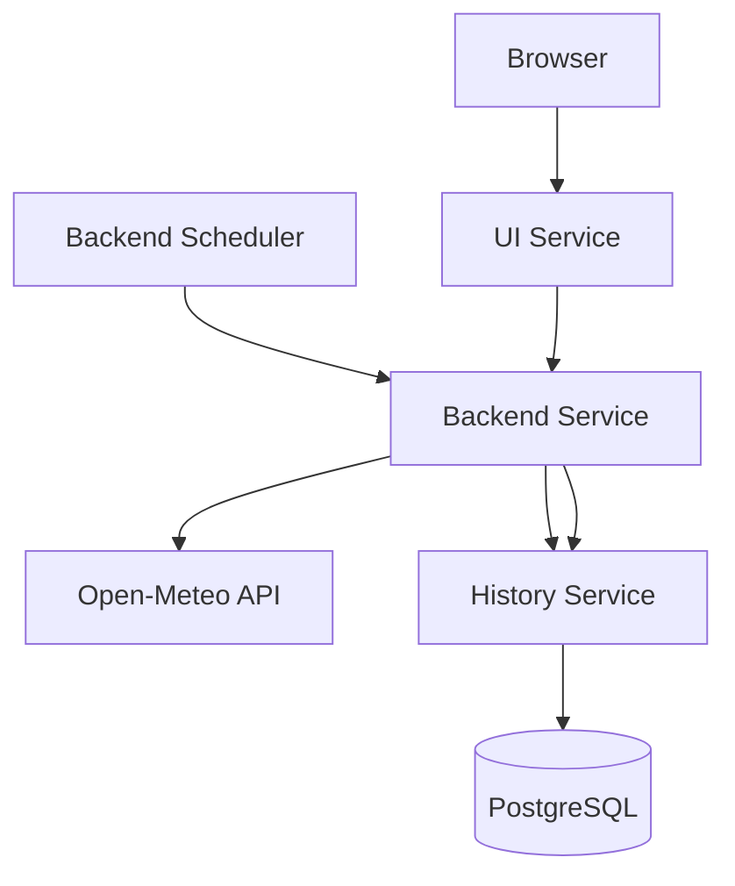
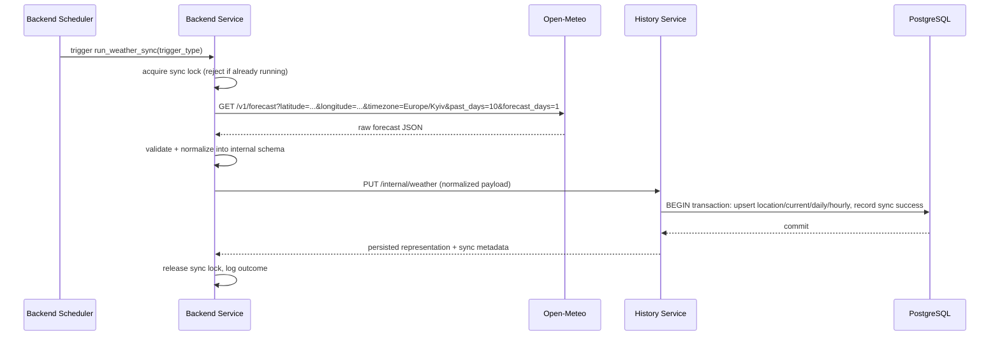
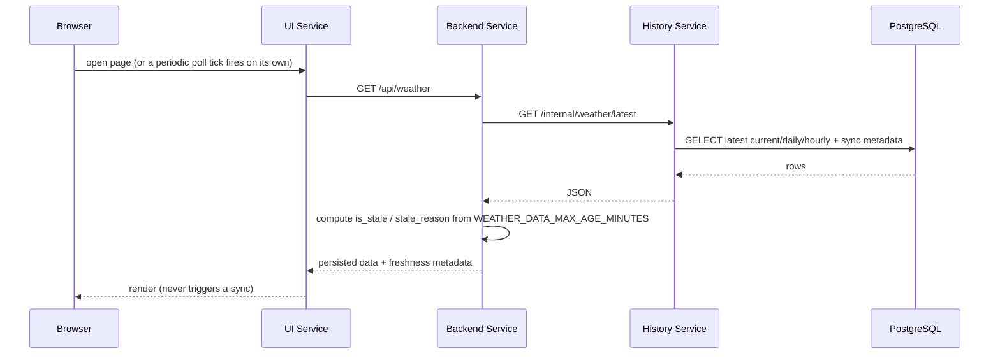

# SkyIvano — Architecture

This is the technical source of truth for the project: architecture, service boundaries, API contracts, database schema, and the reasoning behind the main design decisions. `docs/implementation-plan.md` tracks *how* this gets built in stages; this file describes *what* the system is.

## 1. Purpose

SkyIvano is a modern weather dashboard for a single fixed location — Ivano-Frankivsk, Ukraine — built to demonstrate a clean multi-service architecture: independent services, HTTP-only communication, one service owning persistence, and background synchronization decoupled from user traffic. No Docker/Kubernetes/CI/cloud yet — that is intentionally deferred (see §10).

## 2. High-level architecture

Three independently runnable services plus PostgreSQL:

- **UI Service** — React/TypeScript dashboard. Reads only.
- **Backend Service** — FastAPI. Orchestrates: calls Open-Meteo, normalizes data, runs the sync scheduler, exposes public + internal HTTP APIs.
- **History Service** — FastAPI + SQLAlchemy. The only service that touches PostgreSQL.
- **PostgreSQL** — relational storage, owned exclusively by the History Service.



## 3. Service responsibilities

| Service | Owns | Does NOT do |
|---|---|---|
| UI | Rendering persisted data, polling the Backend on a short interval so a successful scheduled sync appears automatically | Call Open-Meteo, call History, access Postgres, trigger sync |
| Backend | Open-Meteo integration, normalization, scheduling, freshness calculation, public + internal APIs | Access Postgres directly |
| History | Persistence, upserts, sync-attempt bookkeeping, read queries | Call Open-Meteo, contain business logic about freshness |

## 4. Strict service-boundary rules

These are hard rules, not suggestions:

1. The UI communicates only with the Backend Service.
2. The UI never calls Open-Meteo directly.
3. The UI never calls the History Service directly.
4. The UI never accesses PostgreSQL.
5. The UI never triggers weather synchronization.
6. The Backend Service calls Open-Meteo.
7. The Backend Service communicates with the History Service only over HTTP.
8. The Backend Service never accesses PostgreSQL directly.
9. Only the History Service accesses PostgreSQL.
10. The History Service never calls Open-Meteo.
11. Services do not import source code, ORM models, or database models from one another — each service defines its own Pydantic/SQLAlchemy models and the HTTP JSON contract documented below is the only shared "interface".
12. Every service is independently runnable and configured entirely through environment variables (no hardcoded URLs/credentials).

**Why the UI never triggers synchronization:** synchronization is an operational concern (freshness, rate-limiting calls to a third-party API, avoiding duplicate work) that must happen on a predictable schedule regardless of whether anyone is looking at the site. Letting page loads trigger external calls would make Open-Meteo traffic proportional to visitor traffic, couple page latency to a third-party API, and make duplicate/overlapping syncs far more likely.

**Why only the History Service accesses PostgreSQL:** it keeps persistence logic (transactions, upserts, constraints) in one place, lets the Backend stay stateless and easy to scale/restart, and means the database schema can evolve without the Backend needing to know about it.

## 5. Scheduled synchronization flow



Trigger types: `startup`, `scheduler`, `internal_endpoint`. All three call the **same** `run_weather_sync()` function — the scheduler callback itself contains no business logic, only configuration (see `backend-service/app/scheduler/weather_scheduler.py`).

Startup behavior: on boot, if `WEATHER_SYNC_ON_STARTUP=true`, the Backend asks the History Service for the latest successful sync time; if it's newer than `WEATHER_SYNC_STARTUP_FRESHNESS_MINUTES` ago, startup sync is skipped (status `skipped`).

Overlap prevention: an in-process lock/flag shared by the scheduler job, the startup check, and the internal endpoint. APScheduler is additionally configured with `max_instances=1`, `coalesce=True`, `replace_existing=True`, and a reasonable `misfire_grace_time`.

## 6. User read flow



This path never calls Open-Meteo and never starts a synchronization, under any circumstance — including the very first load with an empty database (see §8).

## 7. API contracts

### Backend — public (UI-facing)

| Endpoint | Description |
|---|---|
| `GET /api/weather` | Location, current conditions, today's daily summary, today's hourly series, previous 10 days, and sync metadata (`last_synchronized_at`, `synchronization_status`, `is_stale`, `stale_reason`, `data_source`). Never calls Open-Meteo or triggers sync. |
| `GET /api/weather/history?days=10` | Daily records, newest → oldest, `days` capped at a safe maximum (30). |
| `GET /api/weather/hourly` | Today's hourly records (Europe/Kyiv). |
| `GET /api/sync-status` | Latest status, last success/attempt time, next scheduled run (if known), whether a sync is currently running, staleness. |
| `GET /api/health` | Service status, scheduler enabled flag, optional History Service reachability. No side effects. |

### Backend — internal (not called by the UI)

| Endpoint | Description |
|---|---|
| `POST /internal/weather/sync` | Runs one synchronization synchronously; returns metadata only (never the raw Open-Meteo payload). Rejects/no-ops if a sync is already in progress. **Unauthenticated in v1 — see §11.** |
| `GET /internal/scheduler/status` | Enabled/running, configured interval, next run time, in-progress flag. |

### History Service — internal (Backend-facing only)

| Endpoint | Description |
|---|---|
| `PUT /internal/weather` | Accepts one normalized dataset **plus the Open-Meteo call metadata** (`open_meteo_request_url`, `open_meteo_status_code`, `open_meteo_duration_ms`). Upserts location, current, daily, hourly, and records a successful sync (including that call metadata), all in one transaction. Returns the persisted representation. |
| `GET /internal/weather/latest` | Latest current conditions + today's hourly + today & previous 10 days daily + latest sync metadata (success and last-attempt). |
| `GET /internal/weather/history?days=10` | Daily records, newest → oldest, safe max applied. |
| `GET /internal/weather/hourly?date=YYYY-MM-DD` | Hourly records for a date; defaults to today in Europe/Kyiv. |
| `POST /internal/syncs/failure` | Records a failed synchronization attempt, including whatever Open-Meteo call metadata is available (e.g. a status code from a non-2xx response, or none at all on a timeout/connection error) — the Backend couldn't get valid data, so there's nothing to `PUT`. |
| `GET /internal/syncs` | Synchronization history, newest first. |
| `GET /health` | Service status + database connectivity. No side effects. |

**Why the split into public vs. internal on the Backend:** it makes the UI-safe surface explicit and small, and keeps admin/operational actions (manual sync) clearly separated so they're easy to lock down later (see §11).

## 8. Database schema

Owned exclusively by the History Service. SQLAlchemy 2 models + Alembic migrations. Sync SQLAlchemy (`psycopg` v3 driver — chosen over `psycopg2` because it ships prebuilt wheels for current Python versions; `psycopg2-binary` had none available at implementation time) is used deliberately over async — this is a low-throughput, single-writer service, and sync SQLAlchemy keeps sessions, transactions, and Alembic's migration environment simple to read and explain, which matters more here than raw throughput.

### `locations`
`id, name, country, latitude, longitude, timezone, created_at, updated_at`
**Unique on `(latitude, longitude)`** — coordinates are the true identity of a physical location; name/country are display metadata that could be edited without changing "which place this is."

### `current_weather`
`id, location_id (FK), observed_at, temperature, apparent_temperature, humidity, precipitation, weather_code, cloud_cover, wind_speed, wind_direction, surface_pressure, is_day, source, synchronized_at, created_at, updated_at`
**Unique on `location_id`** — exactly one row per location, holding the latest snapshot. Every successful sync overwrites it (see §12 for why this is intentional and what it means for intraday tracking).

### `daily_weather`
`id, location_id (FK), weather_date, weather_code, temperature_max, temperature_min, apparent_temperature_max, apparent_temperature_min, sunrise, sunset, precipitation_sum, rain_sum, snowfall_sum, precipitation_hours, wind_speed_max, wind_gusts_max, source, synchronized_at, created_at, updated_at`
**Unique on `(location_id, weather_date)`** — one row per calendar day; today's row is refreshed in place as new syncs arrive; past days accumulate and are preserved.

### `hourly_weather`
`id, location_id (FK), weather_time, temperature, apparent_temperature, humidity, precipitation_probability, precipitation, weather_code, cloud_cover, visibility, wind_speed, wind_direction, synchronized_at, created_at, updated_at`
**Unique on `(location_id, weather_time)`** — one row per hour slot. Because Open-Meteo returns 24 hourly slots for "today," repeated syncs through the day naturally build up a same-day intraday curve without needing a separate time-series table.

### `weather_syncs`
`id, location_id (FK), started_at, completed_at, status, source, trigger_type, open_meteo_request_url, open_meteo_status_code, open_meteo_duration_ms, records_received, daily_records_received, hourly_records_received, error_message, created_at`
`status ∈ {in_progress, success, failed, skipped}` (Python/SQLAlchemy `Enum`, not a Postgres-native enum type — simpler to migrate and equally safe). `trigger_type ∈ {startup, scheduler, internal_endpoint}`. This is the only table that gets a **new row on every sync attempt** — it's the audit trail; it does not store weather values.

`open_meteo_request_url`, `open_meteo_status_code`, and `open_meteo_duration_ms` record the actual outbound call to Open-Meteo (the only external API this system calls) — not just whether the resulting sync succeeded, but what was requested, what HTTP status came back, and how long it took. The Backend measures these around its `open_meteo_client` call and passes them to the History Service as part of `PUT /internal/weather` (success case) or `POST /internal/syncs/failure` (failure case, where `open_meteo_status_code`/`open_meteo_duration_ms` may be null if the call never returned, e.g. a timeout). All three columns are nullable for `skipped` syncs, which never call Open-Meteo at all.

All four weather tables use `INSERT ... ON CONFLICT (...) DO UPDATE` on their unique constraints. Database constraints are the final protection against duplicates, not just application-level checks.

### Preserving history for future statistics

`daily_weather` and `hourly_weather` are append-and-update, never pruned — a day's row, once created, stays forever and is only refreshed. This is deliberate: it means a future stats feature (e.g. "average temperature this month," trend charts) can be built purely by querying existing rows, with no schema changes and no backfill needed.

## 9. Error and stale-data behavior

If Open-Meteo or persistence fails:
- A failed sync attempt is recorded (`weather_syncs.status = failed`, with `error_message`).
- Previously persisted data is never deleted or partially overwritten — `PUT /internal/weather` runs in one transaction; any failure rolls the whole thing back.
- The UI keeps showing the last successful data, marked stale if applicable.

If no data has ever been persisted (fresh install, first sync hasn't run/succeeded yet): `GET /api/weather` returns a clear "no data yet" response — never fabricated values. The UI shows a friendly empty/initializing state.

**Staleness** is computed by the Backend, never by the UI or History Service:

```
is_stale = (now - last_synchronized_at) > WEATHER_DATA_MAX_AGE_MINUTES
```

`stale_reason` is one of: `synchronization overdue`, `latest synchronization failed`, `synchronization time unavailable`. All comparisons use timezone-aware datetimes (UTC in the database, Europe/Kyiv at the presentation boundary) — never naive datetimes.

## 10. Environment variables

**backend-service**: `OPEN_METEO_BASE_URL`, `HISTORY_SERVICE_BASE_URL`, `WEATHER_LOCATION_NAME`, `WEATHER_COUNTRY`, `WEATHER_LATITUDE`, `WEATHER_LONGITUDE`, `WEATHER_TIMEZONE`, `HTTP_TIMEOUT_SECONDS`, `WEATHER_SYNC_ENABLED`, `WEATHER_SYNC_INTERVAL_MINUTES`, `WEATHER_SYNC_ON_STARTUP`, `WEATHER_DATA_MAX_AGE_MINUTES`, `WEATHER_SYNC_STARTUP_FRESHNESS_MINUTES`, `BACKEND_PORT`, `BACKEND_CORS_ORIGINS`.

**history-service**: `DATABASE_URL`, `DATABASE_ECHO`, `DATABASE_POOL_SIZE`, `DATABASE_MAX_OVERFLOW`, `HISTORY_SERVICE_PORT`.

**ui-service**: `VITE_BACKEND_BASE_URL` — the *only* configuration value the UI has. No Open-Meteo URL, no History Service URL, no database configuration, no sync endpoint ever appears in UI code or env.

## 11. Production security considerations (not implemented in v1)

- `/internal/*` endpoints on both the Backend and History Service have no authentication in this assignment. In production they should require a network boundary (private network / VPC), a shared secret or mTLS between Backend↔History, and should not be reachable from the public internet.
- CORS on the Backend is currently permissive to the local UI origin only — production would tighten this to the real UI domain.
- No rate limiting on `/internal/weather/sync` — production should add it to prevent abuse of the manual trigger.

## 12. Design decisions

1. **The UI does not trigger synchronization** — it only reads. (§4)
2. **Weather collection is independent of user traffic** — a scheduled job, not a request handler. (§5)
3. **The Backend owns all external API communication** — Open-Meteo is a Backend-only concern.
4. **The History Service owns persistence** — sole owner of PostgreSQL and its schema.
5. **The UI displays persisted data only** — never a live pass-through of Open-Meteo.
6. **Public read endpoints never call Open-Meteo** — reads and syncs are fully decoupled code paths.
7. **Failed synchronization never deletes existing data** — transactions + "keep last good state" semantics.
8. **Database constraints prevent duplicates** — uniqueness is enforced at the DB level, application upserts are the mechanism, not the guarantee.
9. **APScheduler is acceptable for this local, single-instance version** — it's in-process, simple, and sufficient without adding a message queue or external scheduler.
10. **A future Kubernetes deployment should replace the in-process scheduler with a CronJob (or another single external scheduler)** — running APScheduler inside multiple replicas would cause duplicate syncs; that's explicitly out of scope for v1 but documented so the migration path is clear.
11. **Internal endpoints require protection in production** — deliberately left open in v1 per assignment scope, documented in §11.
12. **Stored data can be returned as stale, with explicit metadata** — the system never silently presents old data as current.
13. **`current_weather` is a single overwritten row, not a time series** — intraday change is already visible through `hourly_weather`'s 24 daily slots; a dedicated append-only reading-history table was considered and intentionally deferred (see chat history / `docs/project-status.md`) to keep the schema at the complexity the assignment calls for.
14. **Sync (not async) SQLAlchemy in the History Service** — simpler sessions, transactions, and Alembic setup for a low-throughput single-writer service; async is reserved for the Backend's outbound HTTP calls (Open-Meteo, History Service), where concurrency actually matters.
15. **Every outbound Open-Meteo call is recorded in `weather_syncs`, not just the sync outcome** — `open_meteo_request_url`/`open_meteo_status_code`/`open_meteo_duration_ms` capture what was actually requested and what came back, on both success and failure. This was scoped deliberately to the one external API this system calls; a full request-level audit log of every internal HTTP call (UI→Backend, Backend→History) was considered and rejected as overengineering for this assignment — it edges into distributed tracing, which the spec explicitly avoids. Every table already carries timezone-aware `created_at`/`updated_at` plus its own domain timestamp (`observed_at`, `synchronized_at`, `weather_date`, `weather_time`, `started_at`/`completed_at`), so no additional generic "timestamp everything" change was needed elsewhere.
16. **`psycopg` (v3) instead of `psycopg2`** — at implementation time `psycopg2-binary` had no prebuilt wheel for the locally available Python version, so building it required system Postgres dev headers (`pg_config`) that a fresh machine won't have. `psycopg` v3 is SQLAlchemy 2's other first-class sync driver, installs cleanly via a binary wheel, and needs no code changes beyond the connection string (`postgresql+psycopg://`).
17. **The UI reflects a successful sync via short polling, not a push channel or a sync-triggering button** — `useWeather` polls `GET /api/weather` on a short interval (60 seconds), so a scheduler success is visible on-screen within about one interval with zero added infrastructure. A manual "Reload displayed data" button was considered; it's implemented (a `reload()` function exists) but intentionally not wired to any visible control yet, since with a short poll interval it adds little on top of just waiting a few seconds, and it's a trivial one-line change to re-enable later if wanted. A push mechanism (WebSocket/SSE) was also considered and rejected as overengineering for this assignment — it would add a new infrastructure component for a problem short polling already solves adequately.

## 13. Future work (explicitly out of scope now)

- **Docker / Docker Compose**: containerize each service + Postgres for one-command local startup.
- **Kubernetes**: Deployments per service, a CronJob replacing the in-process scheduler, ConfigMaps/Secrets for env vars.
- **CI/CD**: lint + test + build pipeline, then automated deploy.
- **Cloud deployment**: managed Postgres, container hosting, HTTPS/domain, secrets management.
- **Monitoring**: structured log shipping, metrics (sync success rate, Open-Meteo latency), alerting on repeated sync failures.
- **Statistics endpoints**: monthly/seasonal aggregates built on the preserved `daily_weather`/`hourly_weather` history (§8).
