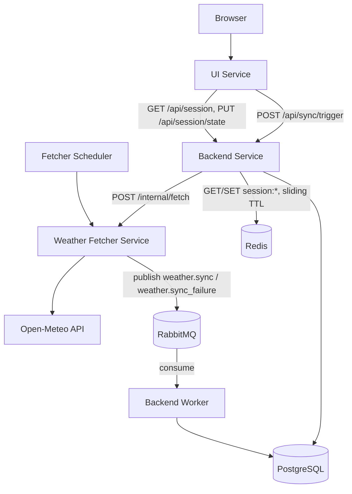
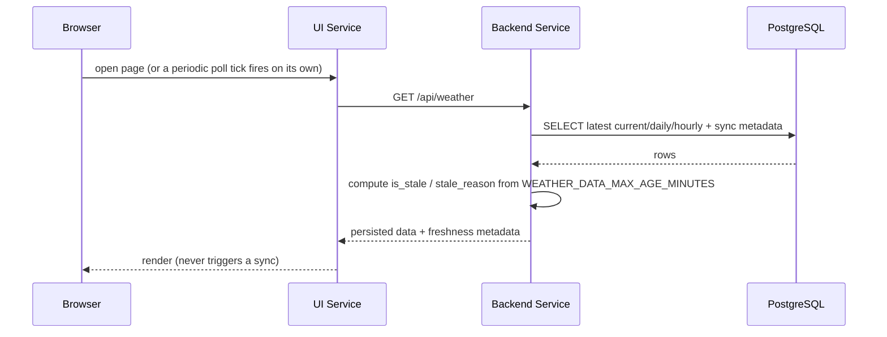
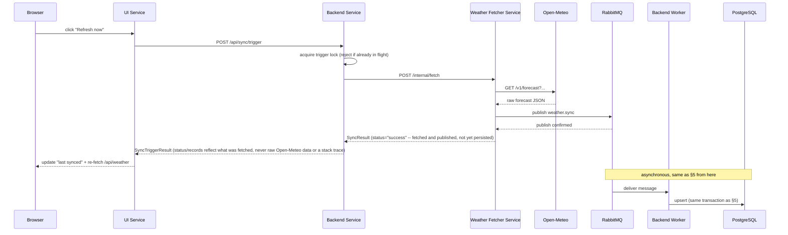

# SkyIvano — Architecture

This is the technical source of truth for the project: architecture, service boundaries, API contracts, database schema, and the reasoning behind the main design decisions. `docs/implementation-plan.md` tracks *how* this gets built in stages; this file describes *what* the system is.

## 1. Purpose

SkyIvano is a modern weather dashboard for a single fixed location — Ivano-Frankivsk, Ukraine — built to demonstrate a clean multi-service architecture: independent services, HTTP communication for reads and one manual-refresh trigger, asynchronous messaging for the Fetcher→Backend data hand-off, one service owning persistence, and background synchronization decoupled from user traffic. Every service (plus PostgreSQL, Redis, and RabbitMQ) is containerized via Docker Compose, one Compose project per Vagrant VM (§18); Kubernetes/CI/cloud remain intentionally deferred (see §14).

## 2. High-level architecture

**Refactor complete (Stage 5 of 5).** SkyIvano was originally built as three services (UI, Backend, History) and has been restructured into four application services (UI, Backend, a Weather Fetcher) plus PostgreSQL, Redis, and RabbitMQ. Stage 1 merged the old History Service's persistence layer into the Backend. Stage 2 extracted all Open-Meteo/scheduling responsibility out of the Backend into a new Weather Fetcher Service, connected to the Backend by a synchronous internal HTTP contract. Stage 3 added the statistics/forecast API the UI needs. Stage 4 rebuilt the UI to consume all of it — see §15. Stage 5 replaced that Stage 2 HTTP contract with asynchronous messaging over RabbitMQ: the Fetcher publishes a completed (or failed) sync instead of pushing it over HTTP, and a separate worker process on the Backend consumes and persists it — see §5, §7, §8, §17. The History Service no longer exists in the repository at all — see `docs/prompts/refactor-0-discovery-and-plan.md` for the full staged plan.

Four independently runnable application processes (across four services) plus PostgreSQL, Redis, and RabbitMQ:

- **UI Service** — React/TypeScript dashboard. Reads only.
- **Backend Service** — FastAPI. Owns PostgreSQL directly: serves the public API to the UI. Also owns Redis, for ephemeral UI session state only (§16) — never calls Open-Meteo.
- **Backend Worker** — a separate process from the Backend Service above (same codebase, `python -m app.worker`), consuming synced weather data from RabbitMQ and persisting it via the same `persistence_service` the API used to call synchronously. Not a distinct "service" in the Stage-2 sense — it shares the Backend's database, schema, and code, just not its request/response cycle. See §17.
- **Weather Fetcher Service** — FastAPI. The only service that calls Open-Meteo. Runs the sync scheduler independently of user traffic, normalizes the response, and publishes it to RabbitMQ for the Backend Worker to consume. Never touches PostgreSQL, never touches Redis, never pushes data to the Backend over HTTP anymore.
- **PostgreSQL** — relational storage, owned exclusively by the Backend Service (and its Worker process).
- **Redis** — ephemeral UI session state (selected graph period, filters, toggles), owned exclusively by the Backend Service. Never business/weather data, never authentication. Co-located on the `postgres` VM in the Vagrant deployment (§14, §16).
- **RabbitMQ** — the durable queue carrying completed/failed syncs from the Fetcher to the Backend Worker (§17). Co-located on the same `postgres` VM (§14, §17).



The bottom edge (`UI → Backend → Fetcher`) is the **one** path by which a user action can reach the Fetcher — the manual "Refresh now" button. It is never a direct UI→Fetcher call, and the Backend never initiates it on its own; see §4. Note that this edge still ends at the Fetcher over HTTP — only the *data hand-off after the fetch* (the former `PUT /internal/weather/sync`) moved to RabbitMQ, not this trigger.

## 3. Service responsibilities

| Service | Owns | Does NOT do |
|---|---|---|
| UI | Rendering persisted data, polling the Backend, the manual refresh button | Call Open-Meteo, call the Fetcher directly, access Postgres, trigger a *scheduled* sync |
| Backend (API process) | Read queries, freshness calculation, public API, proxying one manual-refresh call to the Fetcher, session state (Redis) | Call Open-Meteo, run a scheduler, consume from RabbitMQ, contain SQLAlchemy-free normalization logic |
| Backend Worker (separate process) | Consuming `weather.sync`/`weather.sync_failure` from RabbitMQ, persistence (upserts, sync-attempt bookkeeping) via the same `persistence_service` the API process used to call directly | Serve any HTTP endpoint, call Open-Meteo or the Fetcher |
| Fetcher | Open-Meteo integration, normalization, scheduled + on-demand synchronization, publishing results to RabbitMQ | Access Postgres, contain SQLAlchemy models, serve the UI directly, call the Backend to push data |

## 4. Strict service-boundary rules

These are hard rules, not suggestions:

1. The UI communicates only with the Backend Service.
2. The UI never calls Open-Meteo directly.
3. The UI never calls the Fetcher Service directly.
4. The UI never accesses PostgreSQL.
5. The UI never triggers a *scheduled* weather synchronization — the only synchronization a user action can cause is the manual refresh path below, and even that goes through the Backend.
6. Only the Fetcher Service calls Open-Meteo.
7. The Backend Service accesses PostgreSQL directly — the only service that does.
8. The Backend Service never calls Open-Meteo.
9. **The Backend calls the Fetcher in exactly one case:** `POST /api/sync/trigger` (public, UI-facing) forwards synchronously to the Fetcher's `POST /internal/fetch`, on behalf of the UI's manual "Refresh now" button. No other Backend code path may call the Fetcher — the Backend does not poll it, does not manage its scheduler, does not otherwise know it exists.
10. The Fetcher sends normalized data to the Backend only by publishing to RabbitMQ (§8, §17) — no shared code, no shared ORM/schema models, and (as of Stage 5) no direct HTTP call for this either.
11. Every service is independently runnable and configured entirely through environment variables (no hardcoded URLs/credentials).

**Why the UI never triggers a scheduled synchronization:** synchronization is fundamentally an operational concern (freshness, rate-limiting calls to a third-party API, avoiding duplicate work) that must happen on a predictable schedule regardless of whether anyone is looking at the site. Letting ordinary page loads trigger external calls would make Open-Meteo traffic proportional to visitor traffic and couple page latency to a third-party API. The one deliberate exception — a manual refresh button — is a distinct, explicit user action, rate-limited by the same overlap-prevention lock the scheduler itself uses (§5), and it still never touches Open-Meteo directly from the UI's side.

**Why the Backend owns PostgreSQL directly (Stage 1):** the original design kept persistence in a separate History Service so the Backend could "stay stateless." In practice the Backend was the *only* caller of History's internal API — the extra HTTP hop added latency and a second service to keep running for no isolation benefit anyone was using. See decision 18 in §12.

**Why the Fetcher is a separate service from the Backend (Stage 2):** the reverse logic — Open-Meteo integration and scheduling are a genuinely independent concern from persistence and serving. Splitting them means the Backend's public API and database schema can evolve without needing to also own an external API's field names, rate limits, and timeout/retry behavior, and the sync schedule can be tuned/scaled independently of read traffic. See decision 19 in §12.

## 5. Scheduled synchronization flow

```mermaid
sequenceDiagram
    participant S as Fetcher Scheduler
    participant F as Weather Fetcher Service
    participant O as Open-Meteo
    participant Q as RabbitMQ
    participant W as Backend Worker
    participant P as PostgreSQL

    S->>F: trigger run_fetch_sync(trigger_type)
    F->>F: acquire fetch lock (reject if already running)
    F->>O: GET /v1/forecast?...&past_days=10&forecast_days=10
    O-->>F: raw forecast JSON
    F->>F: validate + normalize; split daily rows into observed (date <= today) vs. forecast (date > today)
    F->>Q: publish weather.sync (current + daily + daily_forecast + hourly + sync metadata)
    Q-->>F: publish confirmed (message accepted onto the queue)
    F->>F: release fetch lock, log outcome ("success" means published, not yet persisted)
    Note over Q,P: asynchronous from here -- may happen milliseconds or longer after F returns
    Q->>W: deliver message
    W->>W: BEGIN transaction: upsert location/current/daily/daily_forecast/hourly, record sync success
    W->>P: commit
    W-->>Q: ack (message deleted from the queue)
```

Trigger types: `startup`, `scheduler`, `internal_endpoint`. All three call the **same** `run_fetch_sync()` function in the Fetcher (moved from the Backend's `run_weather_sync()` in Stage 1, renamed since it no longer also persists) — the scheduler callback itself contains no business logic, only configuration (see `fetcher-service/app/scheduler/weather_scheduler.py`).

**The manual refresh path uses the identical function.** `POST /internal/fetch` (called either directly, e.g. by an admin, or by the Backend's `POST /api/sync/trigger` proxy on the UI's behalf) runs `run_fetch_sync("internal_endpoint")` — there is no separate code path for a "manual" fetch.

**Open-Meteo request window:** `past_days=WEATHER_PAST_DAYS` (default 10) and `forecast_days=WEATHER_FORECAST_DAYS` (default 10) are requested in the same call. The Fetcher splits the returned `daily` array by comparing each row's date to "today" in `WEATHER_TIMEZONE`: dates ≤ today go in the payload's `daily` field (observed, accumulated forever in `daily_weather` — see §8); dates > today go in `daily_forecast` (replaced, not accumulated, in the `daily_forecast` table). Today's own row is treated as observed, not forecast — it's the current day's actual data, not a prediction.

**Persistence is now decoupled from the fetch entirely (Stage 5 change from Stage 2).** In Stage 2, persistence was a synchronous `PUT /internal/weather/sync` HTTP call across the Fetcher→Backend boundary — `run_fetch_sync` didn't return until the Backend had committed. As of Stage 5, the Fetcher publishes to RabbitMQ and returns as soon as the broker accepts the message; the actual database write happens later, in the Backend Worker's own process, off the Fetcher's critical path. `persistence_service.upsert_weather()` itself (models, transaction, upsert logic) is completely unchanged by this — only *what calls it* changed, from a FastAPI route handler to a RabbitMQ message handler (`app/broker/consumer.py`). See §17 for the queue contract and delivery guarantees.

Startup behavior: on boot, if `WEATHER_SYNC_ON_STARTUP=true`, the Fetcher asks the Backend's **public** `GET /api/sync-status` (a lightweight HTTP read — this one check was never part of the push contract, and stays HTTP even after Stage 5) for the latest successful sync time; if it's newer than `WEATHER_SYNC_STARTUP_FRESHNESS_MINUTES` ago, startup sync is skipped. If the Backend can't be reached to answer that question, the Fetcher fetches anyway (fail-open) — unlike Stage 1's equivalent check against PostgreSQL (a Backend-internal precondition), a temporarily-unreachable Backend has no bearing on whether the Fetcher can still do its own job.

Overlap prevention: an in-process lock in the Fetcher, shared by the scheduler job and `POST /internal/fetch` (and therefore also the Backend's proxy, since it just calls that same endpoint). APScheduler is additionally configured with `max_instances=1`, `coalesce=True`, `replace_existing=True`, and a reasonable `misfire_grace_time`. The Backend has a **second, separate** lock scoped only to `POST /api/sync/trigger` itself, so a double-click of the UI's refresh button is rejected immediately without even reaching the Fetcher. None of this changed in Stage 5 — these locks govern the fetch itself, not the now-asynchronous persistence step after it.

## 6. User read flow



This path never calls Open-Meteo, never calls the Fetcher, and never starts a synchronization, under any circumstance — including the very first load with an empty database (see §9). Unchanged from Stage 1: a direct PostgreSQL query via `weather_query_service`, called in-process from the request-scoped `Depends(get_db)` session. Route handlers are plain `def`, not `async def` — FastAPI runs sync route functions in a thread pool automatically, the correct pattern for blocking sync-SQLAlchemy work.

## 7. User manual-refresh flow



This is the **only** way a user action can cause an Open-Meteo call — and even then, the Backend never calls Open-Meteo itself, it only forwards to the one service that does. A Fetcher outage during this flow returns `{"status": "failed", ...}` with HTTP 200, not a 500 — a Fetcher being unreachable is a reported condition, not a Backend crash.

**As of Stage 5, this flow's HTTP response no longer means "persisted."** Through Stage 2–4, `SyncTriggerResult` reflected a completed database write, because the whole chain was synchronous. Now the Fetcher returns to the Backend as soon as it has published to RabbitMQ — the Backend Worker's actual upsert happens afterward, out of band (§5, §17). A `"success"` status here means "Open-Meteo was called and the result was queued," not "the dashboard already reflects it." The UI's immediate re-fetch of `/api/weather` right after this may still show the *previous* data; the next poll tick (`useWeather`'s 60-second interval, §15) is what actually picks up the Worker's write once it lands. This was a deliberate trade-off: a "queued" response accurately describes what the Fetcher can promise once persistence is decoupled from it, rather than the Backend blocking the HTTP response on a RabbitMQ consumer it doesn't control.

## 8. API contracts

### Backend — public (UI-facing)

| Endpoint | Description |
|---|---|
| `GET /api/weather` | Location, current conditions, today's daily summary, today's hourly series, previous 10 days, and sync metadata (`last_synchronized_at`, `synchronization_status`, `is_stale`, `stale_reason`, `data_source`). Never calls Open-Meteo or triggers sync. |
| `GET /api/weather/daily?from=&to=` | Recorded daily rows (including the Stage 3 `average_*` fields), newest first. **Replaces Stage 1's `GET /api/weather/history?days=`** — no artificial cap; omit both `from`/`to` for every stored date ("all available data"). `from > to` → `400`. |
| `GET /api/weather/daily/{date}` | The raw recorded daily row for one date. `404` if that date was never recorded. |
| `GET /api/weather/forecast?days=10` | Predicted days from `daily_forecast` only — never reads `daily_weather`. `days` capped at 16 (Open-Meteo's own forecast ceiling). |
| `GET /api/weather/hourly` | Today's hourly records (Europe/Kyiv). |
| `GET /api/weather/statistics/daily/{date}` | One day's statistics: averages, min/max, dominant weather condition. `404` if that date was never recorded — distinct from an empty *period*, which is a valid zeroed response, not a `404`. |
| `GET /api/weather/statistics?from=&to=` | Period statistics using **every** stored date in range, never capped at 10. `from > to` → `400`; no matching dates → a zeroed, non-error response. |
| `GET /api/weather/statistics/all` | Same shape as the period endpoint, spanning every stored date ever recorded. |
| `GET /api/weather/charts?from=&to=` | Chart-ready time series (temperature/humidity/precipitation/wind), ordered ascending by date. Omitting `from`/`to` returns every stored date — not hardcoded to 10. |
| `GET /api/sync-status` | Latest status, last success/attempt time, whether a *manual* refresh is currently in flight through this Backend, staleness. Also read by the Fetcher itself for its startup-freshness check (§5). |
| `POST /api/sync/trigger` | The one deliberate exception to "Backend never calls Fetcher" — proxies to the Fetcher's `POST /internal/fetch` and relays the result. Never returns Open-Meteo's raw response or a stack trace. **As of Stage 5, a `"success"` status means the fetch succeeded and was published to RabbitMQ — not that the Backend Worker has persisted it yet** (§7, §17). |
| `GET /api/sync/history?limit=20` | Recent synchronization attempts, newest first (thin read over `weather_syncs`) — backs the UI's sync-history log. |
| `GET /api/health` | Service status, direct database connectivity (`database_connected`). Returns HTTP 503 with `status: "degraded"` if PostgreSQL is unreachable. No side effects. |
| `GET /api/session` | Ensures a Redis-backed session exists for this browser and returns its stored UI state, creating one with default state on the first call. See §16. |
| `PUT /api/session/state` | Merges a partial UI-state change into the caller's session and refreshes its TTL. Requires a session id already minted by `GET /api/session`. See §16. |

**Stage 3 endpoint change:** `GET /api/weather/history?days=` (Stage 1) is gone, replaced by `GET /api/weather/daily?from=&to=` — same "recorded daily rows, newest first" purpose, but `from`/`to` instead of a `days` count so "all available data" is directly expressible, and the response now carries the computed `average_*` fields. Nothing outside this repo's own tests depended on the old endpoint (the UI hasn't been rebuilt yet), so it was a clean rename rather than an addition alongside the old one.

**Backend — internal HTTP:** none. As of Stage 5, the Backend exposes no `/internal/*` HTTP endpoint at all — the Fetcher-facing contract that used to live at `PUT /internal/weather/sync` / `POST /internal/weather/sync-failure` is now the RabbitMQ contract in §17.

### Weather Fetcher Service

| Endpoint | Description |
|---|---|
| `POST /internal/fetch` | Manually runs the same fetch+push cycle the scheduler uses. Called by an admin directly, or by the Backend's `POST /api/sync/trigger` proxy. **The UI must never call this directly.** Skips (returns `status: "skipped"`) if a fetch is already in progress. |
| `GET /internal/scheduler/status` | Enabled/running, configured interval, next run time, in-progress flag — the Fetcher's own scheduler state (moved here from the Backend in Stage 2). |
| `GET /health` | Service status only — the Fetcher has no database to check connectivity against. |

**Why the Fetcher still keeps a public/internal split even though the Backend no longer has one:** the Fetcher's `/internal/*` endpoints (manual fetch trigger, scheduler status) are genuinely admin/operational surface that must never be UI-reachable, the same reasoning that originally motivated the Backend's split too — it made the UI-safe surface explicit and small, and kept admin/operational actions clearly separated so they're easy to lock down later (see §11). The Backend's half of that split disappeared in Stage 5 simply because its internal side (the Fetcher-push contract) stopped being HTTP at all, not because the underlying reasoning stopped applying.

## 9. Database schema

Owned exclusively by the Backend Service. SQLAlchemy 2 models + Alembic migrations. Sync SQLAlchemy (`psycopg` v3 driver) is used deliberately over async — this is a low-throughput, single-writer service, and sync SQLAlchemy keeps sessions, transactions, and Alembic's migration environment simple. The Backend's few outbound HTTP calls (`POST /api/sync/trigger`'s Fetcher proxy) stay async (httpx); sync DB work is never mixed into that same coroutine without going through `asyncio.to_thread()` or a request-scoped thread-pooled route.

### `locations`
`id, name, country, latitude, longitude, timezone, created_at, updated_at`
**Unique on `(latitude, longitude)`** — coordinates are the true identity of a physical location; name/country are display metadata that could be edited without changing "which place this is."

### `current_weather`
`id, location_id (FK), observed_at, temperature, apparent_temperature, humidity, precipitation, weather_code, cloud_cover, wind_speed, wind_direction, surface_pressure, is_day, source, synchronized_at, created_at, updated_at`
**Unique on `location_id`** — exactly one row per location, holding the latest snapshot. Every successful sync overwrites it (see §12 decision 13).

### `daily_weather`
`id, location_id (FK), weather_date, weather_code, temperature_max, temperature_min, apparent_temperature_max, apparent_temperature_min, sunrise, sunset, precipitation_sum, rain_sum, snowfall_sum, precipitation_hours, wind_speed_max, wind_gusts_max, average_temperature, average_temperature_method, average_apparent_temperature, average_humidity, average_wind_speed, average_cloud_cover, source, synchronized_at, created_at, updated_at`
**Unique on `(location_id, weather_date)`** — one row per calendar day; today's row is refreshed in place as new syncs arrive; past days **accumulate and are preserved forever**. Only ever receives *observed* dates (≤ today) from the Fetcher — see §5.

**`average_*` columns (Stage 3).** Computed by `persistence_service._compute_daily_averages()` at upsert time, from that sync's hourly rows for the same date:
- `average_temperature` and `average_apparent_temperature` are derived from the mean of that date's hourly rows when at least one exists (`average_temperature_method = "hourly"`); otherwise they fall back to `(min + max) / 2` (`average_temperature_method = "min_max_fallback"`). Both fields always share one method — they'd have hourly data available, or not, in lockstep, since both come from the same hourly rows. **Never blended**: a single day's average is either fully hourly-derived or fully fallback, never a mix. `average_temperature_method` is `NOT NULL` — every day has *some* value, since the fallback always has data to work with (`temperature_min`/`temperature_max` are required fields).
- `average_humidity`, `average_wind_speed`, `average_cloud_cover` have no daily min/max column to fall back to, so they stay `NULL` on a day with no hourly data at all — never a fabricated value.
- Backfilled for pre-Stage-3 rows by a data migration (see `alembic/versions/20df9ec2d3ae_*`) that joins existing `hourly_weather` rows by location + local calendar date (converting hourly's UTC storage via `locations.timezone`), falling back to `(min+max)/2` for any day with no matching hourly data.

### `daily_forecast` (new in Stage 2)
`id, location_id (FK), weather_date, weather_code, temperature_min, temperature_max, apparent_temperature_min, apparent_temperature_max, precipitation_probability_max, source, synchronized_at, created_at, updated_at`
**Unique on `(location_id, weather_date)`** — but unlike `daily_weather`, this table is a **pure replace, not an accumulate-forever upsert**: a forecast for a given date is expected to be superseded by a later, more accurate prediction, and there's no guarantee older predictions survive. Only ever receives *future* dates (> today) from the Fetcher. Old forecast rows are left in place after their date passes rather than actively cleaned up — a harmless "what we predicted" artifact, not something the app reconciles against `daily_weather`. Originally planned for a later "statistics" stage, pulled forward into Stage 2 because the Fetcher's payload needed somewhere real to land as soon as it started requesting forecast days — see decision 19.

### `hourly_weather`
`id, location_id (FK), weather_time, temperature, apparent_temperature, humidity, precipitation_probability, precipitation, weather_code, cloud_cover, visibility, wind_speed, wind_direction, synchronized_at, created_at, updated_at`
**Unique on `(location_id, weather_time)`** — one row per hour slot, accumulated forever like `daily_weather`. The Fetcher forwards every hourly row Open-Meteo returns for the full `past_days`+`forecast_days` window (unchanged behavior from before this refactor) — hourly data is not split into observed/forecast the way daily data is; only the daily granularity distinguishes "recorded" from "predicted" today.

### `weather_syncs`
`id, location_id (FK), started_at, completed_at, status, source, trigger_type, open_meteo_request_url, open_meteo_status_code, open_meteo_duration_ms, records_received, daily_records_received, forecast_records_received, hourly_records_received, error_message, created_at`
`status ∈ {in_progress, success, failed, skipped}`. `trigger_type ∈ {startup, scheduler, internal_endpoint}`. This is the only table that gets a **new row on every sync attempt** — it's the audit trail; it does not store weather values. `forecast_records_received` (new in Stage 2) counts the `daily_forecast` rows from that sync, alongside the existing daily/hourly counts.

`open_meteo_request_url`, `open_meteo_status_code`, and `open_meteo_duration_ms` record the actual outbound call to Open-Meteo (the only external API this system calls, and now only the Fetcher makes it) — not just whether the resulting sync succeeded, but what was requested, what HTTP status came back, and how long it took. The Fetcher measures these around its `open_meteo_client` call and forwards them to the Backend Worker as part of the `weather.sync` message (success case) or `weather.sync_failure` message (failure case, where `open_meteo_status_code`/`open_meteo_duration_ms` may be null if the call never returned, e.g. a timeout). All three columns are nullable for `skipped` syncs, which never call Open-Meteo at all.

All weather tables use `INSERT ... ON CONFLICT (...) DO UPDATE` on their unique constraints. Database constraints are the final protection against duplicates, not just application-level checks.

### Preserving history for statistics

`daily_weather` and `hourly_weather` are append-and-update, never pruned — a day's row, once created, stays forever and is only refreshed. `daily_forecast` is the deliberate exception (above). This is by design: the Stage 3 statistics/chart layer is built purely by querying `daily_weather` (no `hourly_weather` reads needed at query time — the averages are precomputed at upsert time, see above), with no schema changes beyond the six `average_*` columns and no backfill of historical *behavior*, only of the new columns' values.

### Statistics and chart calculation (Stage 3)

`app/services/statistics_service.py` and `app/services/chart_service.py` compute everything from PostgreSQL, in the Backend — nothing is left for the UI to calculate client-side that can be computed reliably here. Both read via `weather_query_service.get_daily_range_by_dates()`, which is deliberately unbounded (no last-N-days cap, unlike the `_get_daily_range()` helper `GET /api/weather` still uses) — period and all-time statistics use **every** matching stored date. An empty date range is a valid, zeroed response (`available_days: 0`), not an error; an invalid range (`from > to`) is rejected with `400` at the API layer before either service is called. Weather-code-based counts (rainy/snowy/clear/cloudy days, dominant/most-common condition) use a fixed WMO-code-to-bucket mapping in `app/services/weather_condition.py`, documented there — fog folds into "cloudy" since the spec asks for exactly four buckets.

## 10. Error and stale-data behavior

If Open-Meteo, the Fetcher→Backend push, or persistence fails:
- A failed sync attempt is recorded (`weather_syncs.status = failed`, with `error_message`).
- Previously persisted data is never deleted or partially overwritten — `persistence_service.upsert_weather` runs in one transaction; any failure rolls the whole thing back, unchanged since Stage 1. A `PersistenceError` from that rollback used to be caught by an explicit FastAPI exception handler and returned as a clean `500` when this ran inside `PUT /internal/weather/sync`; as of Stage 5 it's raised inside the Backend Worker's message handler instead, where it causes that message to be nacked and dead-lettered rather than turned into an HTTP response (§17) — either way, the rollback guarantee itself is identical.
- The UI keeps showing the last successful data, marked stale if applicable.

If no data has ever been persisted (fresh install, first sync hasn't run/succeeded yet): `GET /api/weather` returns a clear "no data yet" response — never fabricated values. The UI shows a friendly empty/initializing state.

**Staleness** is computed by the Backend, never by the UI or the Fetcher:

```
is_stale = (now - last_synchronized_at) > WEATHER_DATA_MAX_AGE_MINUTES
```

`stale_reason` is one of: `synchronization overdue`, `latest synchronization failed`, `synchronization time unavailable`. All comparisons use timezone-aware datetimes (UTC in the database, Europe/Kyiv at the presentation boundary) — never naive datetimes.

## 11. Environment variables

**backend-service**: `DATABASE_URL` *(required, no default)*, `DATABASE_ECHO`, `DATABASE_POOL_SIZE`, `DATABASE_MAX_OVERFLOW`, `FETCHER_SERVICE_BASE_URL` *(used exclusively by `POST /api/sync/trigger`)*, `HTTP_TIMEOUT_SECONDS`, `WEATHER_DATA_MAX_AGE_MINUTES`, `RABBITMQ_URL`, `RABBITMQ_SYNC_QUEUE`, `RABBITMQ_SYNC_FAILURE_QUEUE`, `RABBITMQ_DEAD_LETTER_EXCHANGE`, `RABBITMQ_PREFETCH_COUNT` *(read only by the Worker process, `app/worker.py` — see §17)*, `REDIS_URL`, `REDIS_SESSION_TTL_SECONDS` *(session storage only, see §16)*, `BACKEND_PORT`, `BACKEND_CORS_ORIGINS`. No Open-Meteo URL, no scheduler settings, no location coordinates — the Backend persists whatever location the Fetcher reports and has no reason to know it independently.

**fetcher-service**: `OPEN_METEO_BASE_URL`, `BACKEND_INTERNAL_BASE_URL` *(as of Stage 5, used only for the read-only startup freshness check, `GET /api/sync-status` — no longer for pushing data)*, `RABBITMQ_URL`, `RABBITMQ_SYNC_QUEUE`, `RABBITMQ_SYNC_FAILURE_QUEUE`, `RABBITMQ_DEAD_LETTER_EXCHANGE`, `WEATHER_LOCATION_NAME`, `WEATHER_COUNTRY`, `WEATHER_LATITUDE`, `WEATHER_LONGITUDE`, `WEATHER_TIMEZONE`, `WEATHER_PAST_DAYS` (default 10), `WEATHER_FORECAST_DAYS` (default 10), `WEATHER_SYNC_ENABLED`, `WEATHER_SYNC_ON_STARTUP`, `WEATHER_SYNC_INTERVAL_MINUTES`, `WEATHER_SYNC_STARTUP_FRESHNESS_MINUTES`, `HTTP_TIMEOUT_SECONDS`, `FETCHER_PORT`. No `DATABASE_URL` — this service never touches PostgreSQL.

The `RABBITMQ_*` queue/exchange names must match between the two services exactly — whichever process connects to RabbitMQ first declares the queue with its dead-letter arguments, and the other side's declaration must be identical or RabbitMQ rejects it (`PRECONDITION_FAILED`). There is no shared config file enforcing this; it's an implicit contract between two independent `.env` files, same as the queue/exchange names themselves.

**ui-service**: `VITE_BACKEND_BASE_URL` — the *only* configuration value the UI has. No Open-Meteo URL, no Fetcher Service URL, no database configuration, no internal sync endpoint ever appears in UI code or env. Unchanged since before the refactor.

**history-service**: gone. Deleted entirely at the end of Stage 2 (§2).

## 12. Production security considerations (not implemented in v1)

- `/internal/*` endpoints on the Fetcher have no authentication in this assignment (the Backend no longer has any `/internal/*` HTTP endpoint at all, as of Stage 5). In production they should require a network boundary (private network / VPC), a shared secret or mTLS, and should not be reachable from the public internet.
- RabbitMQ itself has no meaningful access control in this assignment beyond a non-`guest` username/password (required anyway once the Fetcher and Backend Worker are on different LAN hosts — RabbitMQ refuses `guest` from outside `localhost`). No TLS on the AMQP connection, no per-queue permission scoping beyond the one shared user. Production should add TLS and a narrower-permissioned user per service.
- CORS on the Backend is currently permissive to the local UI origin only — production would tighten this to the real UI domain.
- No rate limiting on `POST /api/sync/trigger` or `POST /internal/fetch` — production should add it to prevent abuse of the manual trigger (the in-process locks prevent *overlapping* fetches, not repeated rapid ones from a determined caller).

## 13. Design decisions

1. **The UI does not trigger scheduled synchronization** — it only reads, plus one explicit manual-refresh action that still goes through the Backend. (§4)
2. **Weather collection is independent of user traffic** — a scheduled job, not a request handler. (§5)
3. **Only the Fetcher Service owns external API communication** — Open-Meteo is a Fetcher-only concern as of Stage 2. (Originally the Backend's role — see decision 19.)
4. **The Backend Service owns persistence** — sole owner of PostgreSQL and its schema. (Originally the History Service's role — see decision 18.)
5. **The UI displays persisted data only** — never a live pass-through of Open-Meteo.
6. **Public read endpoints never call Open-Meteo or the Fetcher** — reads and syncs are fully decoupled code paths, with one narrow, explicit exception (`POST /api/sync/trigger`).
7. **Failed synchronization never deletes existing data** — transactions + "keep last good state" semantics.
8. **Database constraints prevent duplicates** — uniqueness is enforced at the DB level, application upserts are the mechanism, not the guarantee.
9. **APScheduler is acceptable for this local, single-instance version** — it's in-process, simple, and sufficient without adding an external scheduler. Now runs in the Fetcher rather than the Backend, same reasoning. (Stage 5 did add a message queue, RabbitMQ — but for decoupling the Fetcher's data hand-off to the Backend, an unrelated concern from *when the fetch itself runs*, which this decision is about. See decision 26.)
10. **A future Kubernetes deployment should replace the in-process scheduler with a CronJob (or another single external scheduler)** — running APScheduler inside multiple Fetcher replicas would cause duplicate syncs; that's explicitly out of scope for v1 but documented so the migration path is clear.
11. **Internal endpoints require protection in production** — deliberately left open in v1 per assignment scope, documented in §12.
12. **Stored data can be returned as stale, with explicit metadata** — the system never silently presents old data as current.
13. **`current_weather` is a single overwritten row, not a time series** — intraday change is already visible through `hourly_weather`'s 24 daily slots; a dedicated append-only reading-history table was considered and intentionally deferred to keep the schema at the complexity the assignment calls for.
14. **Sync (not async) SQLAlchemy for persistence** — simpler sessions, transactions, and Alembic setup for a low-throughput single-writer workload; async is reserved for outbound HTTP calls, where concurrency actually matters.
15. **Every outbound Open-Meteo call is recorded in `weather_syncs`, not just the sync outcome** — `open_meteo_request_url`/`open_meteo_status_code`/`open_meteo_duration_ms` capture what was actually requested and what came back, on both success and failure. Scoped deliberately to the one external API this system calls; a full request-level audit log of every internal HTTP call was considered and rejected as overengineering — it edges into distributed tracing, which the spec explicitly avoids.
16. **`psycopg` (v3) instead of `psycopg2`** — `psycopg2-binary` had no prebuilt wheel for the locally available Python version at implementation time; `psycopg` v3 installs cleanly via a binary wheel and needs no code changes beyond the connection string.
17. **The UI reflects a successful scheduled sync via short polling** — `useWeather`, `useForecast`, and `useSyncStatus` each poll their respective Backend endpoint on the same short interval (60 seconds), independently of each other. The UI-triggered manual refresh (`POST /api/sync/trigger`, Stage 4's `StatusStrip` "Refresh now" button) is a separate, additive path — see §15 — not a replacement for polling.
18. **The History Service was merged into the Backend (Stage 1)** — the original design kept persistence in a separate service so the Backend could "stay stateless," but the Backend was History's only caller, so the extra HTTP hop added latency and a service to keep running for no isolation benefit anyone used. The merge was a relocation of working code (models, migrations, persistence/query logic moved via `git mv`, largely unedited), not a rewrite.
19. **The Weather Fetcher was extracted as its own service, separate from the Backend (Stage 2)** — the reverse move from decision 18: Open-Meteo integration and scheduling are a genuinely independent concern from persistence and serving. Splitting them lets the Backend's public API and schema evolve without also owning an external API's field names/rate limits/timeouts, and lets the sync schedule be tuned or scaled independently of read traffic. `open_meteo_client.py`, `normalization/`, and `weather_scheduler.py` moved via `git mv`, largely unedited in substance (the client gained configurable `past_days`/`forecast_days`; the normalizer gained one optional field; the scheduler's startup-freshness check was rewritten to ask the Backend over HTTP instead of querying a local database it no longer has).
20. **`daily_forecast` was added in Stage 2, not deferred to a later "statistics" stage** — once the Fetcher started requesting `forecast_days=10` (needed to build the UI's planned 10-day-forecast view later), its payload needed somewhere real to persist; silently dropping the forecast half of every sync would have been worse than building the (small, simple) table now. It's a pure replace-on-upsert table, deliberately not given `daily_weather`'s accumulate-forever guarantee, since a stale prediction has no value once superseded.
21. **The Backend's `/api/sync/trigger` has its own overlap lock, separate from the Fetcher's** — even though the Fetcher's own lock already prevents a duplicate *fetch*, the Backend rejecting an obviously-redundant second click immediately (without even making the HTTP round-trip to the Fetcher) is simpler to reason about and cheaper than always proxying through and relying on the far side to say "skipped."
22. **A database-persistence failure now surfaces as an HTTP 500 rather than a soft degraded response** — since the Stage 1 merge, the database is the Backend's own fundamental precondition for doing anything, not a second, independently-flaky networked dependency the Backend could route around the way it once could with History. `GET /api/health`'s `database_connected` field is the intended way to detect this class of problem, not a generic "stale" flag on every read endpoint.
23. **Daily averages are computed and stored at persist time, not at read time (Stage 3)** — `average_temperature`/`average_apparent_temperature`/`average_humidity`/`average_wind_speed`/`average_cloud_cover` are columns on `daily_weather`, not values recalculated from `hourly_weather` on every statistics/chart request. Since `hourly_weather` accumulates forever and is never pruned, recomputing an average across a growing table on every read would get slower over time for no benefit — the value for a given day never changes after that day's last sync, so it's cheap to compute once and store.
24. **`GET /api/weather/history?days=` was replaced, not kept alongside `GET /api/weather/daily?from=&to=`** — both exist to serve the same "recorded daily rows" need; keeping two endpoints doing almost the same thing would just be two things to keep in sync for no benefit, since nothing outside this repo's own tests depended on the old one yet (the UI hasn't been rebuilt). See §8.
25. **`dominant_weather_condition` is computed from `weather_code` at read time, not stored as a column** — unlike the `average_*` fields (expensive-ish to recompute, since they'd need `hourly_weather`), bucketing an already-stored `weather_code` into clear/cloudy/rain/snow is a cheap, pure function (`weather_condition.bucket_for_code()`) with no need for a redundant stored copy that could drift from the code it's derived from.
26. **The Fetcher→Backend data hand-off was converted from synchronous HTTP to asynchronous RabbitMQ messaging (Stage 5)** — decoupling *when a fetch completes* from *when it's persisted* means a slow or momentarily-unavailable database no longer blocks the Fetcher's fetch cycle, and a burst of manual-refresh clicks can't turn into a pile of blocked HTTP requests waiting on the Backend's single-writer database. The trade-off, accepted deliberately: persistence is no longer confirmed within the same request/response cycle that triggered it (§7).
27. **Persistence moved into a separate Backend Worker process (`app/worker.py`), not an in-process consumer inside the FastAPI app** — a long-running RabbitMQ consumer loop has a different lifecycle and failure mode than a request/response API server; running it as its own process means a consumer crash or restart never affects API availability, and vice versa, and the two can be scaled or restarted independently later. The cost is a second process to run per environment (a second container in the Vagrant deployment, §18 — originally a second systemd unit before containerization) — accepted since it mirrors the same "separate process per concern" reasoning already applied to the Fetcher's scheduler (decision 19).
28. **Two queues (`weather.sync`, `weather.sync_failure`), mirroring the two former HTTP endpoints 1:1** — rather than one queue with a discriminator field. This kept the message bodies identical to the existing `WeatherUpsertRequest`/`SyncFailureRequest` Pydantic schemas with zero redesign, and lets each queue's dead-letter behavior, consumer logic, and any future scaling be reasoned about independently.
29. **A message that can't be processed is dead-lettered once, not retried indefinitely** — both queues declare `x-dead-letter-exchange`/`x-dead-letter-routing-key` pointing at a shared `weather.dlx` exchange, routing a nacked message to `<queue>.dead`. The Backend Worker's consumer (`app/broker/consumer.py`) always nacks with `requeue=False` on any failure — a bad message shape or a rolled-back persistence error will not succeed on a bare retry, so looping it back onto the same queue forever would just be a slow-motion outage; landing it once on the dead-letter queue for manual inspection was judged simpler than building retry-count tracking (e.g. inspecting `x-death` headers) for a local, single-instance assignment. `persistence_service`'s upserts being idempotent (decision 8) means the one case that *is* safely retryable — redelivery after the Worker crashes mid-write, before acking — is already handled by RabbitMQ's own redelivery-on-disconnect behavior, without needing the dead-letter path at all.

## 14. Future work (explicitly out of scope now)

Docker/Docker Compose containerization is done (§18) — remaining deferred work:

- **Kubernetes**: Deployments per service, a CronJob replacing the in-process scheduler, ConfigMaps/Secrets for env vars.
- **CI/CD**: lint + test + build pipeline, then automated deploy.
- **Cloud deployment**: managed Postgres, container hosting, HTTPS/domain, secrets management.
- **Monitoring**: structured log shipping, metrics (sync success rate, Open-Meteo latency), alerting on repeated sync failures.
- **Code-splitting the UI bundle**: `vite build` reports a single ~608 KB (178 KB gzipped) JS chunk, mostly Recharts — acceptable for this assignment's scope, but a real deployment would lazy-load the Averages section's chart bundle via dynamic `import()` so the Hero/Today/Forecast sections render before it downloads.

## 15. UI architecture and design (Stage 4)

The UI is a single scrolling page — no tabs, no page navigation — that reads exclusively from the Backend's public `/api/*` endpoints (§8) via `ui-service/src/api/weatherApi.ts`, the *only* file that constructs a URL. `VITE_BACKEND_BASE_URL` is the UI's one configuration value (§11); no Open-Meteo URL, Fetcher URL, or `/internal/*` path ever appears in `src/`.

**Layout, top to bottom:** `WeatherBackground` (an existing, unchanged full-viewport gradient that reacts to weather condition + day/night, 11 variants) → `Header` (branding only) → Hero (`CurrentWeatherCard` + `WeatherMetrics`, current conditions) → `StatusStrip` (sync chip, last-synced toggle that expands an inline sync-log accordion, "Refresh now") → three sections that render immediately, with no click required: **Today** (`HourlyTimeline`, a 24-hour list — deliberately not a chart), **Forecast** (`ForecastStrip`, a 10-day list of cards each tagged "Predicted" — also not a chart, since forecast values are expected to change before their date arrives and a precise chart would imply false precision), **Averages** (`AveragesSection`, the *only* section with charts, covering temperature/humidity/precipitation/wind/condition-distribution, with its own "Last 7 / 10 / 30 / All" date-range control) → an "Open history ↗" button → `HistoryOverlay`, a modal that only fetches while open, with its own independent date-range control and a plain list (no chart), satisfying the accessibility "table view" requirement for the app's only charted data.

**Independent loading per section, not one big spinner.** `useWeather` (Hero/Today), `useForecast` (Forecast), and the `useStatistics`/`useCharts` pair (Averages, via a shared `useAsyncResource` hook) each load, poll (Hero/Forecast, 60s — the same `POLL_INTERVAL_MS` as before), and fail independently; a Forecast outage doesn't blank the Hero, and vice versa. History fetches only while its overlay is open (`enabled` gate on `useAsyncResource`), so opening or refreshing the page never fetches history data unasked.

**Manual refresh (`StatusStrip`)** calls `POST /api/sync/trigger` — the one path a user action can cause a synchronization (§4, §7) — and never calls the Fetcher or Open-Meteo. On success or failure alike, it re-pulls `GET /api/weather` and `GET /api/sync-status` (both idempotent reads), and refreshes the sync-history log if it's currently open; Forecast/Averages simply catch up on their next poll tick rather than being force-invalidated, a deliberate, simpler "eventual consistency" choice consistent with the rest of the app's polling model.

**Chart library: Recharts (v3).** Chosen for first-class React/TypeScript support, a declarative API that maps cleanly onto the five chart types needed (line+band, area, bar, two-line, donut), and no dependency on a canvas/WebGL runtime that would complicate SSR-free static hosting. All five charts, plus every stat tile, are computed from data the Backend already returns (`GET /api/weather/statistics*`, `GET /api/weather/charts`) — the UI does no aggregation of its own beyond assembling the temperature min–max band from the chart endpoint's existing `minimum`/`maximum` fields.

**Chart color is a fixed, validated categorical palette** (`--series-1` … `--series-5` in `global.css`: blue/green/amber/red/violet), assigned in a stable slot order per chart and never re-cycled based on which series are present — e.g. the condition-distribution donut always maps clear→series-3, cloudy→series-5, rain→series-1, snow→series-2 regardless of which buckets have nonzero days that period. Every multi-series chart carries a text legend (identity is never color-alone); chart panels use a more opaque inner surface (`--chart-surface`) than the outer glass so data stays readable over the busiest background gradients.

**Visual design: "Glass."** Frosted, translucent cards (`.glass-card`/`.glass-chip`, `backdrop-filter: blur(18px) saturate(160%)`) floating on the existing `WeatherBackground` gradient — dark ink text on light glass, a geometric display face (`"Avenir Next", Avenir, "Century Gothic", Futura`) for headings, a blue accent gradient for primary actions. Reviewed and chosen from several mocked options during Stage 4 planning; see the design-mockup artifacts referenced in `docs/prompts/refactor-4-ui-charts.md`.

**Deliberately one persistent theme, not a system light/dark toggle.** The original UI prompt asked for a derived dark-glass variant. This was a considered deviation: `WeatherBackground` already carries its own weather/day-night-driven theming (11 gradient variants) — layering a second, independent light/dark axis on top of that would fight it rather than complement it (a system "dark mode" has no coherent meaning over an already-dark stormy-night gradient). `global.css` documents this reasoning inline above its `:root` token block.

**No horizontal page scroll.** Every horizontally-scrolling strip (Today's hour list, Forecast's day list) owns its own `overflow-x: auto`; `.app-content > *` sets `min-width: 0` so a flex item's default content-based minimum width can never stretch its ancestors past the viewport, and `overflow-x: hidden` on `html`/`body` is a hard backstop.

## 16. UI session state (Redis)

Redis stores exactly one thing: per-browser UI preferences (selected graph period, filters, toggles) so a refresh restores the previous view instead of resetting to defaults. It is **not** authentication, **not** a user system, and **never** holds weather/business data — that stays in PostgreSQL, owned by the Backend as described above. Redis follows the same ownership rule Postgres already does: it sits entirely behind the Backend Service, and the UI never gets a Redis client or URL, only the two endpoints below.

**Session identity: a header, not a cookie.** The Backend mints an opaque UUID and returns it in the JSON body (`session_id`) rather than a `Set-Cookie`. The UI stores that id in `localStorage` and sends it back as a plain `X-Session-Id` header on the two session endpoints. This was a deliberate deviation from a more conventional cookie-based session: the Vagrant deployment serves the UI and Backend from two different bare LAN IPs over plain HTTP, with no shared domain and no TLS. A cookie would be cross-site there, requiring `SameSite=None; Secure` — which requires HTTPS this project doesn't have. A cookie would work in local dev (`localhost:5173` ↔ `localhost:8000`, same-site) but silently fail to persist on the actual LAN deployment. A header carried explicitly by the UI has no such restriction and behaves identically in both environments.

**Storage shape.** One Redis key per session, `session:{uuid}`, holding one JSON blob (`app/schemas/session.py`'s `UIState`): `averages_range` and `history_range` (each `{preset, range_from, range_to}`, mirroring the UI's `useDateRange` hook — Averages and History each have their own, independent per docs above), and `history_open`. TTL defaults to 30 days (`REDIS_SESSION_TTL_SECONDS`) and slides forward on every read or write (`app/services/session_service.py`). An unknown or expired session id is indistinguishable from a first visit — `GET /api/session` just mints a fresh one rather than erroring.

**Backend code layout**, mirroring the existing Postgres pattern (`app/database/session.py` → `app/cache/redis_client.py`):

| File | Role |
|---|---|
| `app/cache/redis_client.py` | Redis client factory (`get_redis` FastAPI dependency) |
| `app/schemas/session.py` | `DateRangeState`, `UIState`, `UIStatePatch`, `SessionResponse` |
| `app/services/session_service.py` | `load_or_create`, `patch_state` — the only code that touches the `session:*` keys |
| `app/api/session.py` | `GET /api/session`, `PUT /api/session/state` |

**UI code layout**: `useSessionState` (`src/hooks/useSessionState.ts`) is called once, at the top of `App.tsx`, and passed down as a `session` prop to `AveragesSection` and `HistoryOverlay` — calling it more than once would race to mint two different session ids on a first visit, since the browser has no id to send until the first response comes back. It loads the session on mount, exposes `patch()` for optimistic local updates plus a debounced, coalesced `PUT` (multiple rapid changes within the debounce window are merged into one request, not one each). `useSessionSyncedRange` (`src/hooks/useSessionSyncedRange.ts`) wraps one `useDateRange` instance: it hydrates from the persisted value exactly once, the first time the session finishes loading, then pushes every later change back. `App.tsx` does the equivalent inline for the single `history_open` boolean.

**Failure is non-fatal.** A session load/save failure degrades to "no persistence this visit" (`useSessionState`'s `status` becomes `"error"`, hooks simply skip hydration) rather than blocking the dashboard — the same posture the rest of the UI already takes toward its secondary concerns (e.g. a Forecast outage doesn't blank the Hero, §15).

**Infra placement.** Redis runs on the `postgres` VM (`vagrant/postgres/provision.sh`), as its own container in the `infra/postgres` Docker Compose stack (§18), rather than a dedicated VM — it's this project's one "data/infra" node, as opposed to an application node (`backend`/`fetcher`/`ui`), so Redis shares it the same way it would share a data tier in a smaller deployment. As of containerization (§18) it requires a password (`--requirepass`, from `REDIS_PASSWORD`) — a tightening from the original bare-metal posture, which relied only on binding to one IP with no auth at all — still reachable only from inside the bridged LAN, and still holding nothing more sensitive than a graph's date-range preset.

## 17. Async sync delivery (RabbitMQ)

As of Stage 5, this is the *only* way a completed or failed Fetcher sync reaches the Backend — the Stage 2 `PUT /internal/weather/sync` / `POST /internal/weather/sync-failure` HTTP endpoints are gone (§8). See §5 and §7 for where this sits in the two sync flows, and decisions 26–29 (§13) for why.

**The contract: two durable queues, one per outcome.**

| Queue | Published by | Consumed by | Message body |
|---|---|---|---|
| `weather.sync` | Fetcher, on a successful fetch+normalize (`RabbitMQPublisher.publish_weather_sync`) | Backend Worker (`handle_weather_sync_message`) | Same shape as the old `WeatherUpsertRequest`: location, current, daily, daily_forecast, hourly, source, sync metadata |
| `weather.sync_failure` | Fetcher, when Open-Meteo or normalization failed (`RabbitMQPublisher.publish_sync_failure`) | Backend Worker (`handle_sync_failure_message`) | Same shape as the old `SyncFailureRequest`: location, trigger_type, timestamps, error_message, Open-Meteo call metadata |

Both are declared durable, and every message is published with `delivery_mode=PERSISTENT` — a RabbitMQ restart doesn't lose an unconsumed message. Queue/exchange names are configurable (`RABBITMQ_SYNC_QUEUE`, `RABBITMQ_SYNC_FAILURE_QUEUE`, `RABBITMQ_DEAD_LETTER_EXCHANGE`, §11) but must match between the two services, since whichever side connects first declares them.

**Delivery guarantee: at-least-once, made safe by idempotent upserts.** The Backend Worker acknowledges a message only after `persistence_service.upsert_weather`/`record_sync_failure` has committed (`app/broker/consumer.py`'s `message.process()` block) — not on receipt. If the Worker crashes or disconnects between receiving a message and acking it, RabbitMQ redelivers it to the next available consumer. Since every persistence write here is an upsert on a stable unique key (§9), replaying the same message twice is harmless — this is the same reasoning that already made the Stage 2 HTTP contract safe to retry, just applied to redelivery instead of an HTTP retry.

**Poison messages: dead-lettered once, not retried forever.** Both queues are declared with `x-dead-letter-exchange`/`x-dead-letter-routing-key` pointing at a `weather.dlx` direct exchange, bound to `<queue>.dead`. Any exception while processing a message — a body that doesn't parse as JSON, one that fails Pydantic validation, or a `PersistenceError` from a rolled-back transaction — causes the consumer to nack with `requeue=False`, which RabbitMQ routes to the matching dead-letter queue instead of redelivering it to the same queue forever (decision 29). There is currently no automated alerting or reprocessing off the dead-letter queues — inspecting `weather.sync.dead`/`weather.sync_failure.dead` via the management UI (below) is a manual, operational step, acceptable for this assignment's scope but a clear gap for production (§12, §14).

**Backend code layout**, mirroring the existing Redis pattern above (`app/broker/consumer.py` is the RabbitMQ analogue of `app/cache/redis_client.py`):

| File | Role |
|---|---|
| `app/broker/consumer.py` | `handle_weather_sync_message`/`handle_sync_failure_message` (pure decode-and-persist, unit-tested directly), `consume_forever` (the actual aio-pika connection/queue/consumer plumbing) |
| `app/worker.py` | Entry point (`python -m app.worker`) — runs `consume_forever` in its own `asyncio.run`, as its own OS process, separate from `uvicorn app.main:app` |

**Fetcher code layout**: `app/clients/rabbitmq_publisher.py`'s `RabbitMQPublisher` is the only thing that talks to RabbitMQ — a short-lived `aio_pika.connect_robust` connection per publish, mirroring how `BackendClient` (still used for the one remaining HTTP read, `GET /api/sync-status`) opens a short-lived `httpx.AsyncClient` per request. `app/services/fetch_sync_service.py` calls it exactly where it used to call `BackendClient.put_weather_sync`/`post_sync_failure` — the rest of that function (fetch, normalize, split observed/forecast) is untouched by this refactor.

**Infra placement.** RabbitMQ runs on the `postgres` VM (`vagrant/postgres/provision.sh`), as its own container in the `infra/postgres` Docker Compose stack (§18), the same "data/infra" node as Postgres and Redis, for the same reason Redis is there (§16) — it's shared infrastructure, not an application node. Unlike Postgres/Redis, RabbitMQ needs a real, non-`guest` user even in this unauthenticated-by-design v1 (§12): RabbitMQ refuses `guest` logins from anywhere but `localhost` on the broker's own host, and both the Fetcher and Backend Worker VMs connect to it over the bridged LAN, not from `localhost`. The management UI (`rabbitmq_management` plugin, port 15672) is enabled for local inspection of queue depth and the dead-letter queues; it carries the same credentials and the same lack of TLS as the AMQP port itself.

## 18. Containerization (Docker / Docker Compose)

Each Vagrant VM runs Docker Engine + the Compose plugin instead of installing a language runtime directly; every application service, plus Postgres/Redis/RabbitMQ, runs as a container. This is a 1:1 mapping onto the existing VM topology (§2, §14 no longer lists this as future work) — no service moved, no IP/port changed, no `.env` variable was renamed. `vagrant/*/provision.sh` install Docker (official apt repo), write the same `.env` files as before via the same `sed`-rewrite pattern (§11), then run `docker compose up -d --build` in `/app`.

**`network_mode: host` on every container, everywhere.** A container binds directly to its VM's bridged LAN interface rather than getting its own bridge/NAT namespace — so it's reachable at the VM's existing IP (`192.168.0.22x`) exactly as the old bare-metal/systemd processes were. This is what makes the multi-VM topology and containerization compose cleanly: none of the cross-VM URLs in §11 needed to change.

**postgres VM (`infra/postgres/docker-compose.yml`)** — three containers, Postgres/Redis/RabbitMQ, each `image:`-based (not built), each with a healthcheck, `restart: unless-stopped`, a CPU/memory limit, and `json-file` log rotation:
- **Postgres** — the official image only trusts `127.0.0.1` by default (no remote entries in its generated `pg_hba.conf` at all), which would silently refuse every cross-VM connection. A custom `pg_hba.conf` (mounted read-only, `hba_file` passed as a `command` arg) allows `scram-sha-256` auth from the bridged `192.168.0.0/24` subnet — looser than the old bare-metal posture (one exact backend IP) in exchange for not having to template the file per environment; narrow it to a single `/32` if you want that exact posture back. A `docker-entrypoint-initdb.d` shell script creates the second `skyivano_test` database on first init, replacing the old `createdb` calls.
- **Redis** — now requires a password (`--requirepass`, from `REDIS_PASSWORD`) instead of the old bind-to-one-IP-with-no-auth approach (§16). `REDIS_URL` on the Backend side becomes `redis://:<password>@host:6379/0` — `redis-py` parses embedded credentials natively, no application code changed.
- **RabbitMQ** — unchanged in spirit: `RABBITMQ_DEFAULT_USER`/`RABBITMQ_DEFAULT_PASS` replace the old `rabbitmqctl add_user` call; management plugin still enabled.

**backend VM (`backend-service/docker-compose.yml`)** — three containers sharing one built image: `migrate` (one-shot `alembic upgrade head`, `restart: "no"`), `api`, and `worker` (`python -m app.worker`, decision 27). `api` and `worker` each `depends_on: migrate: condition: service_completed_successfully`. Only `api` declares a `build:` section — `migrate`/`worker` reference the same image tag without building it themselves, so `docker compose up --build` builds the Dockerfile once rather than racing three parallel builds to tag the same image. `worker`'s healthcheck is explicitly disabled (it has no HTTP surface to probe; a crashed consumer loop is instead caught by `restart: unless-stopped`).

**fetcher VM (`fetcher-service/docker-compose.yml`)** — a single container. Its Dockerfile hardcodes Gunicorn to `--workers 1`, not left configurable: this service runs an in-process APScheduler (§5), and more than one worker process would each run its own scheduler and duplicate every Open-Meteo sync — the exact failure mode decisions 9–10 already warn about. Containerizing this service made that constraint an enforceable image-level fact rather than just an operational convention.

**ui VM (`ui-service/docker-compose.yml`)** — a multi-stage build: `npm run build` in a `node:20-alpine` stage, then `nginxinc/nginx-unprivileged` (non-root by design) serves the static `dist/` on :5173. `VITE_BACKEND_BASE_URL` is passed as a Docker **build arg**, not a runtime environment variable — Vite bakes `VITE_*` values into the JS bundle at build time (§11, §15), so it must be set before `docker compose build`, not just before `up`.

**Uniform hardening choices**, applied the same way across all four Compose projects: multi-stage builds (build toolchains — `pip`, `npm`, C compilers — never ship in the runtime image), a dedicated non-root user in every image, container healthchecks, `restart: unless-stopped`, a per-container CPU/memory limit (`deploy.resources.limits`), and `json-file` logging capped with `max-size`/`max-file` so a runaway container's logs can't fill a VM's disk. None of this required an application code change — it's entirely in the four `Dockerfile`s and `docker-compose.yml`s plus `infra/postgres/`.
