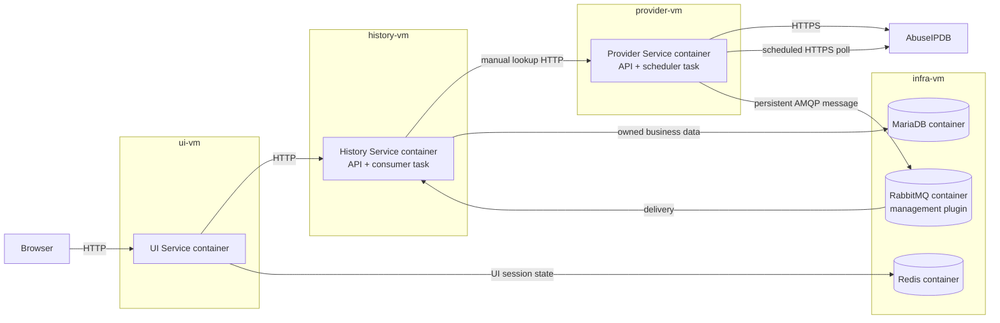
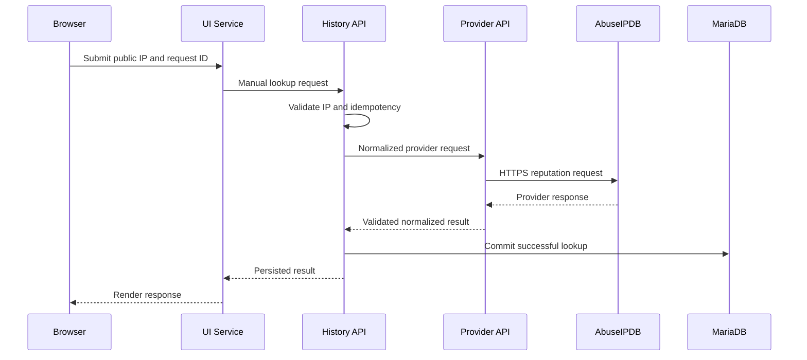
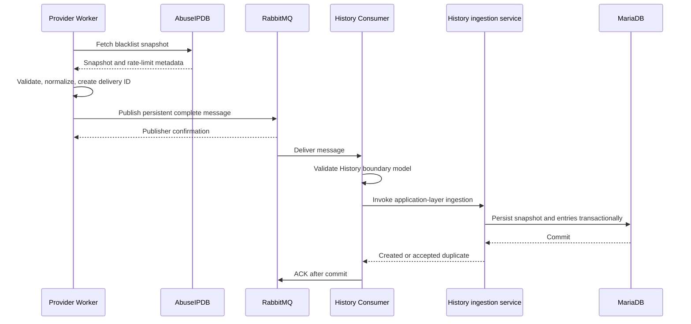

# Aegis target architecture

## Purpose and status

Aegis is an educational multi-service IP reputation application. It validates
public IPv4 and IPv6 addresses, performs individual AbuseIPDB reputation
lookups, periodically retrieves AbuseIPDB blacklist snapshots, persists
authoritative business data, and renders persisted results and analytics.

This document defines the target architecture for the next deployment phase.
The logical service boundaries already exist, but the repository's current
Vagrant provisioning must still be migrated to the container deployment
described here.

The target favors explicit ownership, one container per application service,
asynchronous blacklist delivery, and infrastructure isolated on a dedicated VM.

## Logical services and runtime containers

A logical service owns its configuration, boundary models, application logic,
tests, and dependencies. A runtime container is one independently supervised
process belonging to a logical service.

| Logical service | Runtime container | Purpose |
| --- | --- | --- |
| UI Service | UI Service | Renders pages, handles browser requests, calls History, and manages anonymous UI state |
| History Service | History Service | Exposes `/api/v1/*`; its lifespan consumer ingests RabbitMQ messages |
| Provider Service | Provider Service | Exposes `/internal/v1/*`; its lifespan scheduler polls and publishes |

Provider and History start their controlled background tasks in FastAPI
lifespan. The tasks share the service container lifecycle, stop cooperatively,
and close RabbitMQ resources during shutdown.

No application runtime executes directly on a VM host. Application services are
not combined into a single container.

## Vagrant deployment topology

The target Vagrant environment contains exactly four VMs:

| VM | Containers |
| --- | --- |
| `ui-vm` | UI Service |
| `history-vm` | History Service |
| `provider-vm` | Provider Service |
| `infra-vm` | MariaDB; RabbitMQ with management plugin; Redis |



The application VMs remain separate security and failure boundaries. The three
infrastructure products share `infra-vm`, but remain separate containers with
separate ports, credentials, health checks, and persistent volumes.

## Service boundaries

### UI Service

UI Service owns presentation and anonymous UI state.

Responsibilities:

- render forms, history, blacklist tables, analytics, and safe errors;
- submit manual lookups to History API;
- read persisted blacklist data, status, and analytics from History API;
- create anonymous browser session IDs;
- load and save validated UI preferences in Redis.

Restrictions:

- communicates only with History Service for application data;
- does not call Provider Service or AbuseIPDB;
- does not access MariaDB or RabbitMQ;
- does not store business data in Redis;
- runs only in the UI Service container on `ui-vm`.

### History Service

History Service is the application backend and sole logical owner of MariaDB
data.

Responsibilities:

- expose the application API under `/api/v1/*`;
- validate and normalize public IPv4 and IPv6 addresses;
- enforce manual lookup request idempotency;
- call Provider API for normalized manual reputation data;
- persist successful manual lookup results;
- expose lookup history, blacklist snapshots, status, and analytics;
- own SQLAlchemy models, repositories, Alembic migrations, and transactions;
- validate RabbitMQ messages at the History boundary;
- invoke application-layer ingestion from the lifecycle consumer;
- persist each blacklist snapshot and its entries transactionally;
- deduplicate snapshot delivery by `delivery_id`.

Restrictions:

- does not call AbuseIPDB directly;
- does not expose ORM models across service boundaries;
- does not accept blacklist snapshots from Provider through HTTP;
- does not put SQL in HTTP handlers or RabbitMQ callbacks;
- runs API and consumer task in one History container on `history-vm`.

MariaDB's physical container is on `infra-vm`. Physical placement does not
change logical ownership: only History runtimes receive MariaDB credentials or
network access.

### Provider Service

Provider Service is the internal AbuseIPDB adapter and polling owner.

Responsibilities:

- expose the internal Provider API under `/internal/v1/*`;
- authenticate to AbuseIPDB;
- apply explicit HTTPX timeouts;
- validate and normalize upstream data;
- map provider failures into safe service errors;
- extract rate-limit and `Retry-After` metadata;
- own periodic polling in a controlled FastAPI lifespan task;
- create the complete versioned blacklist message;
- publish it directly to RabbitMQ using persistent delivery, mandatory routing,
  and publisher confirms.

Restrictions:

- does not communicate with UI Service;
- does not access MariaDB or Redis;
- does not deliver blacklist snapshots to History through HTTP;
- does not consume blacklist messages;
- runs API and scheduler task in one Provider container on `provider-vm`.

## Synchronous flows

### Manual lookup



Manual lookups remain synchronous. RabbitMQ is not used for browser requests or
manual lookup responses.

### Persisted reads and analytics

```text
Browser -> UI Service -> History API -> MariaDB
```

UI reads only persisted business data. Rendering and status polling never call
Provider Service or AbuseIPDB.

## Asynchronous blacklist synchronization



Provider Worker publishes directly to RabbitMQ. RabbitMQ remains the only
transport for asynchronous blacklist snapshot delivery; Provider does not push
snapshots to History API.

The direct-publication design has no Provider-side durable staging store.
RabbitMQ becomes the first durable handoff after a positive publisher
confirmation. The worker must keep a fetched message stable during bounded
in-process retries and must not fetch a replacement while that message is still
awaiting confirmation.

## Infrastructure responsibilities

### MariaDB

MariaDB is the authoritative application store and runs in its own container on
`infra-vm`. Only History Service may connect to it.

It stores:

- successful manual lookup records and request IDs;
- complete blacklist snapshots and entries;
- provider and delivery metadata;
- synchronization status;
- analytics source data;
- Alembic schema state.

Blacklist persistence is transactional. A failed delivery does not replace or
delete the latest successful snapshot.

### RabbitMQ

RabbitMQ runs in its own container on `infra-vm` with the management plugin
enabled. It is the durable transport for completed blacklist snapshots.

The default topology is:

| Element | Default |
| --- | --- |
| Main direct exchange | `aegis.blacklist` |
| Main routing key | `blacklist.snapshot.complete` |
| Main durable queue | `aegis.history.blacklist.snapshots` |
| Retry direct exchange | `aegis.blacklist.retry` |
| Retry queues | `aegis.history.blacklist.snapshots.retry.300`, `.retry.900`, `.retry.1800`, `.retry.3600` |
| Dead-letter direct exchange | `aegis.blacklist.dead` |
| Dead-letter queue | `aegis.history.blacklist.snapshots.dead` |

Provider publishes persistent messages with publisher confirms and mandatory
routing. History Consumer declares and consumes the application topology.
History ACKs a successful delivery only after MariaDB commit. Retryable
failures use bounded durable retry queues; permanent or exhausted failures use
the durable dead-letter queue.

### Redis

Redis runs in its own container on `infra-vm` and stores only expiring UI
session preferences. UI Service is its only application client.

Redis contains no credentials, blacklist snapshots, analytics, manual lookup
records, or other authoritative business data. Redis loss cannot corrupt
MariaDB data.

## Delivery identity and failure behavior

Each complete blacklist message contains a versioned schema, message type,
delivery and correlation IDs, producer, provider, creation timestamp, request
metadata, rate-limit metadata, and the complete normalized snapshot.

History stores `delivery_id` under a unique constraint. A repeated committed
delivery ID is accepted without creating another snapshot. Acknowledgement
therefore remains safe after broker redelivery or an ambiguous publisher
confirmation.

Without Provider-side durable staging:

- a failure before RabbitMQ confirms publication can lose the fetched snapshot
  if the Provider process or VM also loses its in-memory message;
- Provider process restart can lose in-memory publication retry state;
- once RabbitMQ confirms publication, broker durability, consumer
  acknowledgements, retry queues, and History idempotency provide at-least-once
  processing;
- the latest committed MariaDB snapshot remains available throughout later
  fetch, publication, or ingestion failures.

The deployment and operational documentation must state this boundary
explicitly and must not claim end-to-end at-least-once delivery before broker
confirmation.

## Data ownership

| Owner | Data or behavior |
| --- | --- |
| UI Service | Presentation models, anonymous sessions, and UI preferences |
| History Service | MariaDB schema, migrations, lookups, snapshots, entries, delivery idempotency, and analytics |
| Provider Service | AbuseIPDB adaptation, polling decisions, and outbound message construction |
| MariaDB container | Authoritative persisted application records |
| RabbitMQ container | Confirmed in-flight deliveries, retries, and dead letters |
| Redis container | Expiring anonymous UI preferences only |

Container placement does not transfer logical data ownership to `infra-vm`.

## Network and secret boundaries

- UI receives only History and Redis connection settings.
- History receives Provider, MariaDB, and RabbitMQ consumer settings.
- Provider receives AbuseIPDB and RabbitMQ publisher settings.
- Provider never receives MariaDB or Redis credentials.
- UI never receives AbuseIPDB, MariaDB, or RabbitMQ credentials.
- History never receives the AbuseIPDB API key.
- MariaDB accepts application traffic only from `history-vm`.
- Redis accepts application traffic only from `ui-vm`.
- RabbitMQ AMQP accepts Provider and History traffic on the private network.
- RabbitMQ management is exposed only on the private Vagrant interface.
- Infrastructure volumes, environment files, and secrets are not mounted into
  unrelated application containers.

## Container lifecycle and health

Each logical application service has an independent container name, command,
restart policy, log stream, and health check.

- UI Service readiness checks History and Redis.
- History readiness checks MariaDB, RabbitMQ, and the consumer task.
- Provider readiness checks RabbitMQ and the scheduler task without performing
  an extra quota-consuming AbuseIPDB request.
- A completed background task makes readiness return HTTP `503`.
- MariaDB, RabbitMQ, and Redis have container-native health checks.

Application logs go to container stdout and stderr. VM hosts supervise container
stacks; they do not execute application Python processes.

## Non-goals

The target design does not:

- merge application VMs;
- create separate worker or consumer containers;
- move MariaDB ownership away from History;
- use Redis for business data or message delivery;
- replace RabbitMQ with direct HTTP snapshot delivery;
- add authentication, Kubernetes, or a public reverse proxy.
