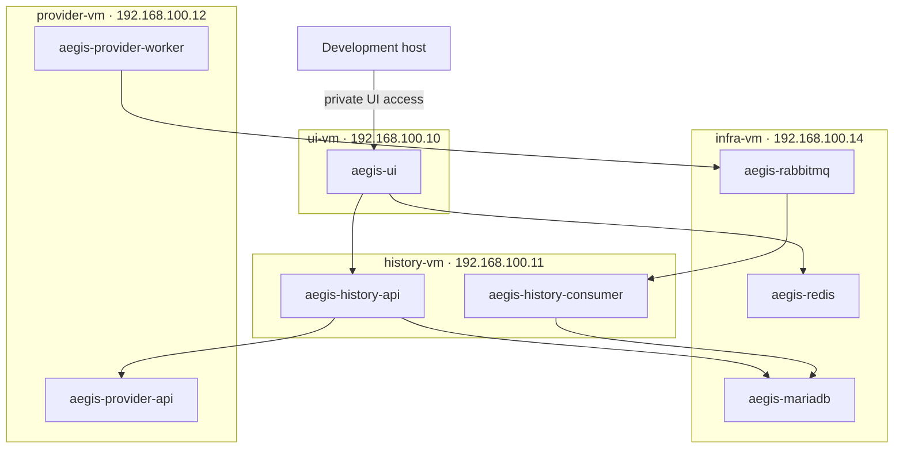

# Vagrant container deployment

## Status

The repository implements this deployment with Vagrant, VirtualBox, Docker
Engine, and the Docker Compose plugin.

## Windows PowerShell workflow

The normal Windows workflow uses native PowerShell. WSL, a host Bash shell,
Docker Desktop, and host-side Python are not required.

Prerequisites:

- 64-bit Windows with hardware virtualization enabled;
- Oracle VirtualBox;
- Vagrant with the VirtualBox provider;
- Git for Windows to obtain the checkout.

Run PowerShell in the repository root. Initialize the untracked deployment
secrets once; the script prompts for the AbuseIPDB API key and generates the
remaining passwords without printing their values:

```powershell
Set-ExecutionPolicy -Scope Process Bypass
.\scripts\Initialize-AegisVagrant.ps1
```

The default secret directory is `$HOME\.config\aegis`. Existing files are
preserved unless `-Force` is supplied.

The supported lifecycle commands are:

```powershell
vagrant validate
vagrant up
vagrant status
vagrant ssh infra-vm
vagrant ssh provider-vm
vagrant ssh history-vm
vagrant ssh ui-vm
vagrant provision <vm>
vagrant reload <vm>
vagrant halt
vagrant destroy -f
```

`vagrant up` provisions the infrastructure VM first, followed by Provider,
History, and UI. When provisioning an individual application VM, keep
`infra-vm` running; UI also requires `history-vm`, and History’s manual lookup
path requires `provider-vm`.

The repository is mounted from its native Windows checkout into `/vagrant`
with the VirtualBox shared-folder provider. Provisioning scripts execute
inside the Linux guests; no repository Bash script is executed by Windows.

## Four-VM topology

All VMs use the private `192.168.100.0/24` network.

| VM | Address | Required containers |
| --- | --- | --- |
| `ui-vm` | `192.168.100.10` | `aegis-ui` |
| `history-vm` | `192.168.100.11` | `aegis-history-api`, `aegis-history-consumer` |
| `provider-vm` | `192.168.100.12` | `aegis-provider-api`, `aegis-provider-worker` |
| `infra-vm` | `192.168.100.14` | `aegis-mariadb`, `aegis-rabbitmq`, `aegis-redis` |

There is no database VM. Application VMs remain separate, and each application
runtime has its own container.



## Host responsibilities

VM hosts provide:

- Docker Engine and the Compose plugin;
- private networking and firewall policy;
- protected deployment environment and secret files;
- persistent infrastructure volume directories on `infra-vm`;
- startup and supervision of the local Compose stack.

VM hosts must not install or execute application virtualenvs, Uvicorn,
Provider Worker, or History Consumer directly. Docker Compose creates,
reconciles, and restarts all application and infrastructure containers.

## Compose stacks

Each VM owns one Compose project.

### ui-vm

The UI stack contains one service:

```text
aegis-ui
  command: UI ASGI server
  publishes: 192.168.100.10:8000
  dependencies: History API, Redis
```

### history-vm

The History stack contains two services built from the same History image:

```text
aegis-history-api
  command: History ASGI server
  publishes: 192.168.100.11:8002

aegis-history-consumer
  command: History Consumer entry point
  publishes: no host port
```

Both receive History-owned MariaDB and RabbitMQ consumer configuration. Only
the API receives the Provider API URL needed for manual lookups. Alembic runs as
an explicit one-shot container command before the API and consumer are started
against a new schema.

### provider-vm

The Provider stack contains two services built from the same Provider image:

```text
aegis-provider-api
  command: Provider ASGI server
  publishes: 192.168.100.12:8001

aegis-provider-worker
  command: Provider Worker entry point
  publishes: no host port
```

Only one Provider Worker container may run. Provider API does not own polling.
Provider Worker fetches a complete snapshot and publishes it directly to
RabbitMQ with persistent delivery, mandatory routing, and publisher confirms.
It has no local database or durable application-state volume.

### infra-vm

The infrastructure stack contains:

```text
aegis-mariadb
  private port: 3306
  persistent volume: MariaDB data

aegis-rabbitmq
  private port: 5672
  private management port: 15672
  persistent volume: RabbitMQ data
  management plugin: enabled

aegis-redis
  private port: 6379
  persistent or disposable volume according to UI-session policy
```

Sharing one VM does not mean sharing credentials, container filesystems, or
logical ownership. History remains the sole owner and application client of
MariaDB data.

## Network policy

Required application paths:

| Source | Destination | Port | Purpose |
| --- | --- | --- | --- |
| Browser/host-only network | `ui-vm` | 8000 | UI |
| `ui-vm` | `history-vm` | 8002 | Application API |
| `ui-vm` | `infra-vm` | 6379 | UI preferences |
| `history-vm` | `provider-vm` | 8001 | Manual lookups |
| `history-vm` | `infra-vm` | 3306 | History-owned persistence |
| `history-vm` | `infra-vm` | 5672 | Consumer and retry/DLQ publication |
| `provider-vm` | `infra-vm` | 5672 | Snapshot publication |
| Private Vagrant network | `infra-vm` | 15672 | RabbitMQ management |

Forbidden paths include UI to Provider or MariaDB, Provider to MariaDB or
Redis, and direct Provider-to-History snapshot delivery.

Container ports bind only where cross-VM traffic requires them. RabbitMQ
management must not bind publicly on the host.

## Secrets and environment ownership

Host-local secret files remain outside the repository:

```text
~/.config/aegis/abuseipdb-api-key
~/.config/aegis/mariadb-password
~/.config/aegis/mariadb-root-password
~/.config/aegis/rabbitmq-provider-password
~/.config/aegis/rabbitmq-history-password
~/.config/aegis/rabbitmq-admin-password
~/.config/aegis/redis-ui-password
```

They are rendered into protected container environment or secret files with
the following ownership:

- UI: History URL and Redis connection settings;
- History API and Consumer: MariaDB credentials and RabbitMQ consumer
  credentials;
- History API: Provider API URL;
- Provider API and Worker: AbuseIPDB configuration where required;
- Provider Worker: RabbitMQ publisher credentials;
- infrastructure containers: only their own bootstrap credentials and config.

Secrets must not be baked into images, committed Compose files, health output,
or logs.

## Persistent data and migration

Persistent infrastructure data belongs on `infra-vm`:

- MariaDB data directory or named volume;
- RabbitMQ data directory or named volume;
- optional Redis persistence used only for disposable UI state.

Moving an existing environment to this topology requires:

1. stop History writes and the old Provider Worker;
2. publish or explicitly disposition any already-fetched pending deliveries
   before removing the old deployment;
3. take a consistent MariaDB backup;
4. start MariaDB on `infra-vm` with a fresh persistent volume;
5. restore and validate the backup;
6. run History Alembic migrations as a one-shot container;
7. verify schema head, row counts, constraints, and delivery IDs;
8. start RabbitMQ and Redis containers and validate their health;
9. start Provider and History background containers;
10. start History API and UI;
11. destroy the former database VM only after validation and backup retention.

The target Provider Worker has no private persistent delivery store. RabbitMQ
is the first durable delivery boundary after publisher confirmation.

## Startup order

Recommended provisioning order:

1. Create all four VMs and private firewall rules.
2. Start the `infra-vm` Compose stack.
3. Wait for MariaDB, RabbitMQ, and Redis health checks.
4. Run the History migration container.
5. Start Provider API and Provider Worker.
6. Start History API and History Consumer.
7. Start UI Service.
8. Run cross-VM health and delivery verification.

Compose dependency declarations do not replace cross-VM readiness checks.

## Operations

Target diagnostics use container commands:

```bash
vagrant ssh infra-vm -c 'sudo docker compose -f /vagrant/deploy/infra-vm/compose.yaml ps'
vagrant ssh history-vm -c 'sudo docker compose -f /vagrant/deploy/history-vm/compose.yaml logs history-consumer'
vagrant ssh provider-vm -c 'sudo docker compose -f /vagrant/deploy/provider-vm/compose.yaml restart provider-worker'
vagrant ssh ui-vm -c 'sudo docker compose -f /vagrant/deploy/ui-vm/compose.yaml logs ui'
```

Infrastructure diagnostics run inside their containers:

```bash
vagrant ssh infra-vm -c \
  'sudo docker exec aegis-rabbitmq rabbitmq-diagnostics -q ping'
vagrant ssh infra-vm -c \
  'sudo docker exec aegis-rabbitmq rabbitmqctl list_queues -p /aegis name consumers messages'
vagrant ssh infra-vm -c \
  'sudo docker exec aegis-mariadb mariadb-admin ping'
vagrant ssh infra-vm -c \
  'sudo docker exec aegis-redis redis-cli ping'
```

Exact deployment directories and Compose service names must remain consistent
with the implementation when it is added.

## Verification requirements

The deployment smoke test must verify:

- exactly four Vagrant VMs exist;
- the former database VM does not exist;
- every required container is running on the correct VM;
- no application Python process or legacy application unit runs on a VM host;
- History API and History Consumer are different containers;
- Provider API and Provider Worker are different containers;
- MariaDB, RabbitMQ, and Redis run together on `infra-vm`;
- only History can connect to MariaDB;
- only UI can connect to Redis;
- Provider publishes and History consumes through RabbitMQ;
- RabbitMQ publisher confirmations, persistent messages, ACK-after-commit,
  retry queues, and DLQ behavior remain intact;
- UI and API health endpoints work;
- MariaDB is at the current Alembic head;
- container restart policies and persistent infrastructure volumes work.

Ordinary unit tests must still mock external infrastructure. Live AbuseIPDB
verification remains explicitly opt-in.

## Security scope

This Vagrant design is for an isolated development environment. Host-only
networking, local secret files, and HTTP are not production Internet-edge
security. Production must add appropriate TLS, secret management, backups, and
host hardening without changing the logical service ownership described here.
